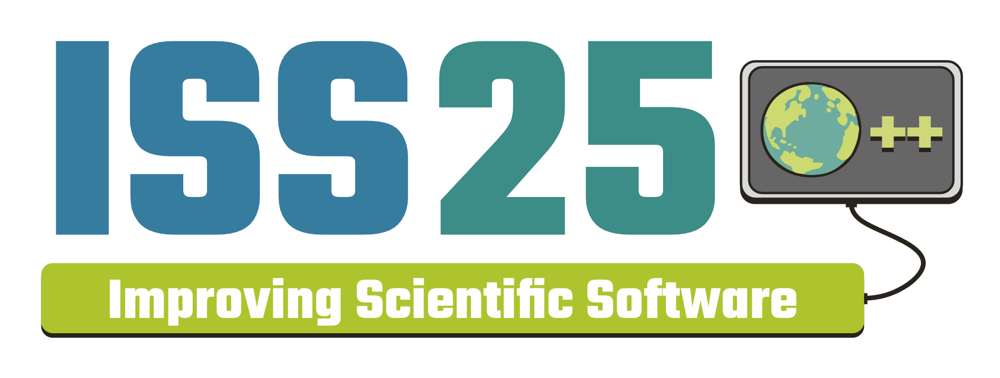

<figure markdown="span">
    
    <figcaption>**From Legacy to Leading-Edge: Transforming Software Design in
    Science to Meet Tomorrow’s Challenges**</figcaption>
</figure>

# Conference Proceedings

These Proceedings from the 2025 Improving Scientific Software Conference
represent the work of many contributors from a wide array of institutions. This
year, the ISS Committee forged ahead with a new Jupyter Notebook proceedings
format, allowing for more transparent review and editing processes, more rapid
interaction with authors, and the potential for interactivity in submissions.

The ISS Proceedings Committee would like to thank all who contributed to this
volume, and we hope that it inspires our 2026 presenters to contribute next
year!

!!! abstract "Proceedings Committee and Editorial Team"
    **Katelyn FitzGerald**, NSF National Center for Atmospheric Research  
    **Michael Flanagan**, NSF National Center for Atmospheric Research  
    **Negin Sobhani**, NSF National Center for Atmospheric Research  
    **Brian Vanderwende**, NSF National Center for Atmospheric Research

---

-   #### [A Practical Framework for Small Teams to Develop Sustainable Research Software](https://ucar-sea.github.io/SEA-ISS-2025-A-Practical-Framework-for-Small-Teams-to-Develop-Sustainable-Research-Software/)

    ---

    **Authors**: Ange (Phil) Du and Spencer Smith

    Currently, a knowledge gap exists between research software and general
    software engineering. The scientific literature is full of ideas to close
    this gap, including documentation templates, code generation, continuous
    integration/deployment and formal methods. Although these ideas are
    promising, they often assume a large team that includes individuals who have
    the required expertise.

    Our proposed practical framework instead targets a small team of domain
    experts, with the only requirement being to find someone (either from the
    original team, or externally added) who is interested in deepening their
    software knowledge by volunteering for the developer role. Our framework,
    especially for the beginning stage of requirements elicitation, includes
    step-by-step guidance. The process begins with questions the developer asks
    the domain expert(s). These questions cover topics such as the expected
    inputs and outputs, the computational scale of the problem and special input
    cases with known solutions or trends. The methodology shows how to map the
    answers to these questions to the requirements, high-level design and
    validation/verification process. Templates for all documentation, in
    markdown format, are provided in a GitHub template, along with the initial
    infrastructure for issue tracking and continuous deployment of the project's
    webpage. The proposed methodology incorporates four main pieces of advice:
    i) the notation and structure for documenting the theory should be selected
    to facilitate the transition to design and implementation; ii) continuous
    integration should be part of the project from the start; iii) the low-level
    design documentation should be done through structured comments in the code,
    like docstrings or doxygen; and, iv) the modular decomposition needs to
    consider the computational scale when balancing information hiding and
    performance.

    ---

    
    
    
  
    
    
    
    
    
    

-   #### [Improving the PBS Pro Experience for NCAR HPC Users](https://ucar-sea.github.io/SEA-ISS-2025-Improving-PBS-for-NCAR-HPC-Users/)

    ---

    **Author**: Brian Vanderwende

    For most HPC users, the jobs scheduling software is an integral component of
    the system, allowing access to the vast compute resources that distinguish a
    cluster from a workstation. A few workload managers are common in
    traditional scientific HPC (e.g., Slurm and PBS) with newer tools like
    Kubernetes also becoming more common. HPC users and administrators are often
    forced to adapt to a new scheduler upon procurement of the latest system, at
    which point they experience the strengths and limitations of the new tool.

    At NSF NCAR, our two main clusters - Derecho and Casper - both run PBS Pro,
    though we have used Slurm in the recent past as well. Compared to some of
    its competitors, PBS Pro's user interface has notable deficiencies: users
    cannot query historical jobs beyond a few days, administrators cannot query
    relative job execution priorities, and some queries impose a serious
    performance impact on the PBS server. To mitigate these weak points, we have
    developed a number of tools including a cached qstat (job query tool), qhist
    (a historical record tool), and pbs_prio (a priority query tool).

    In this notebook, we focus on the qhist utility as a case study,
    demonstrating recent efforts to modernize our PBS tooling. Such efforts
    include adding requested features, incorporating more modern Python
    programming practices, reducing program overhead, improving documentation,
    converting scripts into actual Python packages, using automated deployment,
    and adding regression testing.

    ---

    
    
    
  
    
    
    
    
    
    

-   #### [Toward Generating Experiment-Specific Notebooks in FABRIC](https://ucar-sea.github.io/SEA-ISS-2025-Toward-Generating-Experiment-Specific-Notebooks-in-Fabric/)

    ---

    **Authors**: Mami Hayashida, Joshna Kurra, Zongming Fei, and James Griffioen

    Jupyter notebooks are now widely used by the research community to set up,
    launch, run, analyze, and document scientific experiments. The massive
    number of example notebooks available not only has made it easier for
    researchers to write notebooks, but also represents a wealth of data that
    can be used by Generative AI systems to automatically generate
    experiment-specific notebooks.

    This paper describes the use of RAG-based AI techniques to automatically
    generate jupyter notebooks in the context of FABRIC, an NSF-funded next
    generation network testbed that consists of over 30 sites. To program the
    FABRIC testbed, including reserving and managing resources across the
    network, researchers must use FABlib, a python API. While an extensive
    collection of example notebooks that use FABlib are available to users as
    well as detailed documentation regarding the FABlib API, finding the
    information needed to create a new FABRIC notebook can be difficult,
    especially for first-time users. Moreover, using popular GenAI tools to
    assist with FABRIC code generation often yields poor results as even large
    general-usage LLMs lack testbed-specific knowledge.

    To address this gap, we have implemented an AI-based tool that leverages the
    power of LLMs and Retrieval Augmented Generation(RAG) to generate
    FABRIC-specific code based on the user's spefication. Our initial test
    results show that RAG-enhanced LLMs can significantly improve the accuracy
    of the generated code for FABRIC experiments.

    ---

    
    
    
  
    
    
    
    

-   #### [Helping Scientists Embrace their Inner Research Software Engineer (RSE) and Working Together with the Community Earth System Model (CESM) RSEs to improve CESM Science](https://ucar-sea.github.io/SEA-ISS-2025-Embrace-Inner-RSE/)

    ---

    **Author**: Erik Kluzek

    The Community Earth System Model (CESM) is science expressed in Software,
    which means everyone who touches CESM code to work on the science -- is
    doing RSE work. There is a list of challenges that CESM RSE’s have with both
    bringing in new science for CESM and ensuring CESM is well tested, robust,
    flexible as well as having the correct science. As such CESM Scientists
    working in CESM code need to work alongside CESM RSE’s to adopt RSE
    practices while their science is being developed. For CESM to be useful for
    scientists it needs to be: well-tested, robust, reproducible, flexible and
    have assurance that the science is implemented correctly. This is needed
    both for the science and the software of CESM. Helping scientists embrace
    their inner RSE is an effort to keep CESM as a leading model in Earth System
    Science research, by having more people who work with the CESM code adopt
    good coding practices. In this talk I will specifically talk about RSE
    practices for the Land Model component of CESM, the Community Terrestrial
    Science Mode (CTSM)l. I will present on the RSE challenges we have in CTSM
    and how to solve them we need to involve and educate CTSM scientists to
    improve our RSE practices. I will also present regarding the CTSM RSE team’s
    efforts to educate the scientists and on some improvements to our RSE
    practices that we’ve been implementing on our CTSM Software Development.

    ---

    
    
    
  
    
    
    
    
    
    

-   #### [Event driven architecture for the IMAP science data center](https://ucar-sea.github.io/SEA-ISS-2025-IMAP-architecture/)

    ---

    **Author**: Maxine Hartnett

    As cloud based processing becomes more common in the scientific sphere, a
    huge variety of new tools and techniques are emerging for mission data
    pipelines. Upcoming missions are getting a new opportunity to explore these
    techniques from the ground-up. IMAP, a heliophysics mission launching in
    2025, is able to develop an entire pipeline with a cloud-first attitude. The
    IMAP science data center, based out of LASP, uses tools such as AWS,
    infrastructure as code, and docker to create a flexible, reliable, and
    efficient event-based processing pipeline. The IMAP mission has 10
    instruments, all of which are interdependent, which cover a broad scope of
    scientific data. By creating an event-based system in the cloud, the SDC can
    extend and modify processing based on changing requirements, while also
    ensuring that processing occurs quickly and reliably. This science data
    system takes advantage of the cloud's new ecosystem to create a pipeline
    that runs only what is needed, when it's needed, using small, distinct
    pieces of code that are easy to maintain and modify by the entire team. As
    the cloud becomes more wildely used, it is time to rethink the way we create
    processing pipelines so we can take advantage of the powerful opportunities
    provided by AWS and other cloud providers.
    
    ---

    
    
    
  
    
    
    

-   #### [Improved Accessibility and Community Knowledge of Lidar and Radar Data Analysis](https://ucar-sea.github.io/SEA-ISS-2025-Improved-Accessibility-and-Community-Knowledge-of-Lidar-and-Radar-Data-Analysis/)

    ---

    **Authors**: Jennifer DeHart, Ana Victoria Espinoza, Brenda Javornik, and Julien Chastang

    To improve accessibility and community knowledge of applications in the
    Lidar Radar Open Software Environment (LROSE), a team from the National
    Science Foundation (NSF) National Center for Atmospheric Research, Colorado
    State University, and NSF Unidata has developed a lidar and radar
    meteorology science gateway deployed on the NSF Jetstream2 cloud. Utilizing
    the “Zero to JupyterHub with Kubernetes” workflow, the science gateway
    integrates LROSE with other lidar and radar meteorology software packages.
    This integration allows users to execute applications directly from the
    JupyterLab terminal, streamlining the creation of datasets for further
    analysis and visualization within Jupyter notebooks. By combining
    traditional command-line operations with modern Python-based tools for data
    analysis and visualization, this gateway provides a robust end-to-end
    solution that caters to both educational and research needs. The gateway has
    already facilitated LROSE instructional workshops and classroom exercises.
    Our work demonstrates the significant potential of merging established
    scientific computing techniques with advanced Python environments, opening
    new avenues for computational science education and research.

    ---

    
    
    
  
    
    
    
    
    

-   #### [Cloud microphysics training and aerosol inference with the Fiats deep learning library](https://ucar-sea.github.io/SEA-ISS-2025-Cloud-microphysics-training/)

    ---

    **Authors**: Damian Rouson, Dan Bonachea, Zhe Bai, Ondrej Certik, Baboucarr
    Dibba, Ethan Gutmann, Katherine Rasmussen, and David Torres

    This notebook presents two atmospheric sciences demonstration applications
    in the Fiats deep learning software repository. The first,
    train-cloud-microphysics, trains a neural-network cloud microphysics
    surrogate model that has been integrated into the Berkeley Lab fork of the
    Intermediate Complexity Atmospheric Research (ICAR) model. The second,
    infer-aerosol, performs parallel inference with an aerosol dynamics
    surrogate pretrained in PyTorch using data from the Energy Exascale Earth
    System Model (E3SM). This notebook presents the program statements involved
    in using Fiats for aerosol inference and microphysics training. In order to
    also give the interested reader direct experience with using Fiats for these
    purposes, the notebook details how to run two simpler example programs that
    serve as representative proxies for the demonstration applications. Both
    proxies are also example programs in the Fiats repository. The microphysics
    training proxy is a self-contained example requiring no input files. The
    aerosol inference proxy uses a pretrained aerosol model stored in the Fiats
    JavaScript Object Notation (JSON) file format and hyperlinked into this
    notebook for downloading, importing, and using to perform batch inference
    calculations with Fiats.

    ---

    
    
    
  
    
    
    
    
    
    
    

-   #### [Continuous Integration with research notebooks: on maintaining reproducibility in atmospheric modeling](https://ucar-sea.github.io/SEA-ISS-2025-Continuous-integration-of-research-notebooks/)

    ---

    **Authors**: Agnieszka Żaba, Sylwester Arabas, and open-atmos contributors

    The maintenance of research-result reproducibility can support rather than
    be a challenge of ongoing project development. The integration of research
    notebooks with automated software testing workflows is an essential
    prerequisite for this. We present reusable tools and solutions engineered in
    the development and maintenance of the PySDM and PyMPDATA atmospheric
    modeling projects. Both packages are developed entirely in Python, using
    just-in-time compilation tools (Numba & NVRTC) to enable a single-language
    HPC tech stack that covers simulation, analysis, and visualization codes. We
    will discuss the perspectives of both users and developers on
    reproducibility.

    ---

    
    
    
  
    
    
    
    

