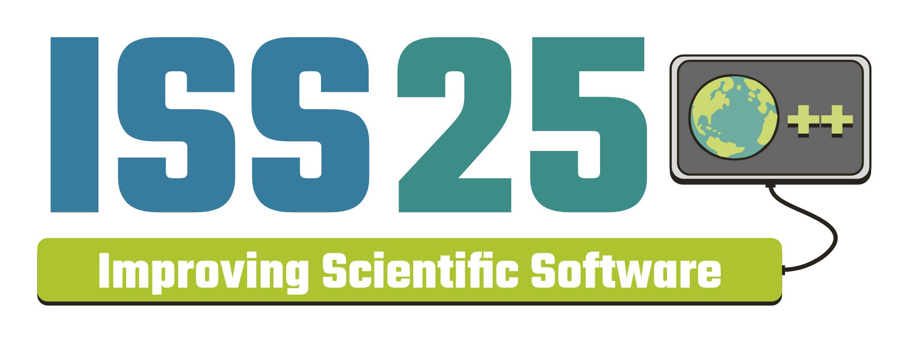

<figure markdown="span">
    
    <figcaption>**From Legacy to Leading-Edge: Transforming Software Design in
    Science to Meet Tomorrow’s Challenges**</figcaption>
</figure>

## Conference Program

=== "Monday, April 7"
    

        

            
<b>8:40 AM</b>

            

            

    ??? abstract cell "Keynote"
        

        

        

            
<b>9:50 AM</b>

            

            

    ??? info cell "Break"
        

        

        

            
<b>10:20 AM</b>

            
Gabriele Bozzola

            

    ??? abstract cell "Beyond Fortran and C++: Exploring Julia for Climate Modeling"
        *Gabriele Bozzola is a Senior Software Engineer at CliMA, where we use Julia to build a
        new GPU, ML-native climate model.*

        The Climate Modeling Alliance (CliMA), a collaboration between Caltech, MIT,
        and JPL, is developing a new climate model using Julia. This talk provides a
        firsthand account of the experience, highlighting both the advantages and
        challenges of this choice. We will examine Julia's performance, ease of use
        for scientists, and its ability to accelerate development cycles. The
        presentation will also address limitations and opportunities for
        improvement, offering a balanced assessment of Julia's suitability for
        various aspects of climate model development and deployment.
            

        

        

            
<b>10:40 AM</b>

            
Hilario Torres

            

    ??? abstract cell "Dynamic Runtime Scheduling in MPI Applications Via Directed Acyclic Graphs"
        *Dr. Hilario (Lalo) Torres recently joined the Applications Scalability
        and Performance (ASAP) group at the National Center for Atmospheric
        Research (NCAR) as a software engineer. Prior to joining NCAR he was
        postdoctoral research fellow at NASA Ames Research Center. While at NASA
        he designed and developed a task based dynamic runtime scheduling system
        to interface with NASA multi-physics high performance computing (HPC)
        applications. He received his PhD in mechanical engineering from
        Stanford University in 2021 where his dissertation focused on writing
        performance portable multi-physics solvers for heterogeneous HPC
        systems. His current research interests are at the intersection of
        computational physics and HPC*

        The current state-of-the-practice for Single-Program, Multiple-Data
        (SPMD) applications utilizes a bulk-synchronous paradigm (BSP)
        implemented with non-blocking Message Passing Interface (MPI)
        communication calls. In this paradigm, the order of execution of the
        computational kernels is hard coded at compile time in order to overlap
        communication and computation in a synchronized fashion. In simple
        applications this approach is relatively easy to implement and can
        provide sufficient parallel scalability. However, it is difficult to
        specify a performant schedule at compile time for applications that
        simultaneously run multiple interdependent algorithms on a diverse set
        of data structures. This presentation covers a library that we have
        developed, Task Graph Scheduler (TGS), to solve this problem by
        dynamically scheduling computational kernels at runtime using directed
        acyclic graphs to track the data dependencies between kernels. This
        system was specifically designed to leverage existing computational
        infrastructure as much as possible, supporting the extension of legacy
        applications. TGS has been incorporated into the eddy high-order
        multi-physics solver developed at NASA. Details regarding the
        implementation, our experiences using this system, and performance will
        be discussed.

        *This research was supported by an appointment to the NASA Postdoctoral
        Program at the NASA Ames Research Center, administered by Oak Ridge
        Associated Universities under contract with NASA. Resources supporting
        this work were provided by the NASA Transformational Tools and
        Technologies project Revolutionary Computational Aerosciences program
        and by the NASA High-End Computing (HEC) Program through the NASA
        Advanced Supercomputing (NAS) Division at Ames Research Center.
            

        

        

            
<b>11:00 AM</b>

            
Nat Efrat-Henrici

            

    ??? abstract cell "Advancing Climate Modeling with Collaborative Software Development in Julia"
        *Nathanael (Nat) Efrat-Henrici is a Software Engineer working at Caltech
        as part of the Climate Modeling Alliance (CliMA). He works primarily on
        the atmosphere model and data assimilation infrastructure. Nat obtained
        his B.S. in Computer Science from Harvey Mudd College in 2022.*

        The Climate Modeling Alliance (CliMA) is developing a novel earth system
        model in Julia with a built-in data assimilation framework. This talk
        explores lessons learned in empowering research scientists by rethinking
        the development of scientific software.

        I will discuss the evolving collaboration between scientists and
        software engineers, highlighting how we lower barriers to computational
        research. Central to this approach is our implementation of continuous
        integration and deployment with robust reproducibility testing, which
        accelerates iterative development.

        A key theme of this talk is the importance of abstracting technical
        complexities while maintaining flexibility and power for advanced
        research. I will showcase how we have streamlined everyday tasks such as
        diagnostic output visualization and routine workflow automation. At the
        same time, we have enabled researchers to easily orchestrate complex,
        reproducible simulations that scale efficiently across high-performance
        computing clusters using portable code and data containers.
        Our model is underpinned by data assimilation methods that simplify the
        process of model calibration. This allows scientists to integrate
        diverse real-world observations to account for small-scale, unmodeled
        processes without requiring deep expertise in machine learning. These
        insights offer a nuanced perspective on accelerating computational
        research through thoughtful software design.
            

        

        

            
<b>11:20 AM</b>

            
Jorge Bravo

            

    ??? abstract cell "Free and open-source tools to develop a web-map visualizer"
        *Jorge Humberto Bravo Mendez, with a background in atmospheric sciences
        and a master’s degree in hydrometeorology, is currently a PhD candidate
        at Stevens Institute of Technology (Hoboken, NJ). His research focuses
        on numerical modeling and remote sensing.*

        In this talk, I will discuss how to use various free and open-source
        tools to visualize geospatial data. While I will showcase a few
        applications, my primary focus will be on satellite data.

        When working with data from numerical or satellite models, typically in
        formats such as GRIB, NetCDF, GeoTIFF, etc., visualization becomes
        essential. While the initial phase involves visualizing the data using
        software (e.g., Unidata-IDV, NCview, QGIS) or programming languages
        (e.g., MATLAB, NCL, Python, R), a website is often required in the next
        phase to effectively present the results to the public.

        By leveraging Python, HTML, JavaScript, CSS, Google Earth Engine, and
        GitLab, it is possible to develop a fully functional website for
        displaying geospatial data.
            

        

        

            
<b>11:40 AM</b>

            
Brian Vanderwende

            

    ??? abstract cell "Improving the PBS Pro Experience for NCAR HPC Users"
        *Brian Vanderwende is a HPC User Support Consultant in the Computational
        Information Systems Laboratory at NSF NCAR in Boulder, CO. He began his
        career as a PhD student in atmospheric science and leverages that
        experience to inform his work improving the user experience for
        researchers. He currently focuses primarily on software stack curation,
        front-end tool development, and user education.*

        For most HPC users, the jobs scheduling software is an integral
        component of the system, allowing access to the vast compute resources
        that distinguish a cluster from a workstation. A few workload managers
        are common in traditional scientific HPC (e.g., Slurm and PBS) with
        newer tools like Kubernetes also becoming more common. For better or
        worse, HPC users and administrators are often forced to adapt to a new
        scheduler upon procurement of the latest system, at which point they
        come to appreciate the strengths and limitations of the new tool.

        At NSF NCAR, our two main clusters - Derecho and Casper - both run PBS
        Pro, though we have used Slurm in the recent past as well. Compared to
        some of its competitors, PBS Pro's user interface has notable
        deficiencies: users cannot query historical jobs beyond a few days,
        administrators cannot query relative job execution priorities, and some
        queries impose a serious performance impact on the PBS server. To
        mitigate these weak points, we have developed a number of tools
        including a cached qstat (job query tool), qhist (a historical record
        tool), and pbs_prio (a priority query tool).

        In this talk, we introduce these tools for those unfamiliar, and also
        discuss recent efforts to modernize them. Such efforts include adding
        requested features, increasing robustness, incorporating more modern
        Python programming practices, improving documentation, converting
        scripts into actual Python packages, and adding regression testing. We
        will also describe how these improvements to our tools will inform
        future priorities as we continue to support our PBS Pro users.
            

        

        

            
<b>12:00 PM</b>

            

            

    ??? info cell "Lunch"
        

        

        

            
<b>1:00 PM</b>

            
Agnieszka Żaba

            

    ??? abstract cell "Continuous Integration with research notebooks: on maintaining reproducibility in atmospheric modeling"
        *I am a PhD student in the Environmental Physics Group
        (zfs.agh.edu.pl/en) at the Faculty of Physics and Applied Computer
        Science, AGH University of Krakow. My research interests lie at the
        intersection between cloud microphysics and climate-science applications
        of water isotopes. I am a member of the github.com/open-atmos community,
        and the maintainer of PySDM project.*

        The maintenance of research-result reproducibility can support rather
        than be a challenge of ongoing project development. The integration of
        research notebooks with automated software testing workflows is an
        essential prerequisite for this. We present reusable tools and solutions
        engineered in the development and maintenance of the PySDM
        (open-atmos.github.io/PySDM) and PyMPDATA
        (open-atmos.github.io/PyMPDATA) atmospheric modeling projects. Both
        packages are developed entirely in Python, using just-in-time
        compilation tools (Numba & NVRTC) to enable a single-language HPC tech
        stack that covers simulation, analysis, and visualization codes. We will
        discuss the perspectives of both user and developer on reproducibility.

        From the user's perspective, maintenance of notebooks that reproduce
        paper results using up-to-date project codebase serves the purpose of
        documenting and exemplifying project features and applications. It
        enables exploratory usage with little-to-no effort needed to set up a
        working environment. However, this is contingent on a design embracing
        modularity and inversion of control - it is not uncommon in atmospheric
        modeling for papers to use different simulation flow control or
        different parameterizations. We present the inversion of control
        solutions from PySDM that enable the choice of formulae and constants
        from user code, without trade-offs in: (i) performance, (ii) ability to
        switch between CPU and GPU backends, and (iii) dimensional analysis of
        physics-relevant routines for testing unit correctness. The maintenance
        of notebooks within code repositories also poses challenges in terms of
        handling embedded visuals. The jupyter-utils project
        (pypi.io/p/open-atmos-jupyter-utils) helps with embedding
        GitHub-renderable and Jupyter-book-compatible vector graphics and
        animations. 

        From the developer's perspective, research notebooks within the code
        repository are a source of test scenarios and constraints for the
        assertions that constitute a robust regression-test suite.
        We present the notebook_vars() function from the jupyter-utils package,
        designed to be used in concert with the fixture logic of the pytest
        framework. It enables the execution of the notebook code once in a test
        session, allowing us of  the final notebook state in multiple automated
        tests. This occurs without modifications to the notebooks themselves. In
        notebooks pertaining to specific research studies, a direct link from
        test code up to subject literature is provided. Overall, we achieve an
        improvement in code readability and refactoring capability.

        The presented solutions, along with the availability of platforms such
        as Google Colab, mybinder.org or institutional Jupyter hubs, ensure
        single-click reproducibility of research-paper results, and a structure
        for retaining this through future releases of the code base. In addition
        to the benefits for software users and developers, this satisfies the
        scientific-method and research-journal reproducibility requirements.
            

        

        

            
<b>1:20 PM</b>

            
Brett Neuman

            

    ??? abstract cell "GitHub Actions Workflows using Self-Hosted Runners for HPC"
        *Brett is a consultant for the Consulting Services Group (CSG) in the
        Computational and Information Systems Laboratory (CISL) at NCAR.  Brett
        supports the High Performance Computing (HPC) research efforts in
        distributed computing workflows, GPU porting, and testing for new
        architectures.  His previous research focused on FPGA, accelerator, and
        mixed precision architectures within Los Alamos National Laboratory’s
        (LANL) HPC Design group.*

        Github Actions provides tools to implement automated workflows for code
        but primarily relies on virtual runner environments for their execution.
        Code designed for High-Performance Computing often requires specific
        architectures, software stacks, and scheduler information that do not
        map to the standard virtual runners.  To improve code verification and
        testing automation, we show how combining GitHub Actions workflows with
        self-hosted runners can be used for code designed to run on HPC systems.
        The self-hosted runner listens for matching workflow flags and sends
        them to the job scheduler using parameters defined within the GitHub
        Actions workflows.  

        While a powerful tool, self-hosted runners present a number of security
        concerns due to the potential for code injection via unverified commits.
        We test and demonstrate a number of mitigations developers can employ to
        reduce these risks.  We also provide a case study on how to implement a
        self-hosted runner on a HPC system and how to create workflows that will
        use the job scheduler to target different architectural requirements for
        CPUs, GPUs, and memory.
            

        

        

            
<b>1:40 PM</b>

            
Kyle Chard

            

    ??? abstract cell "Transforming Scientific Discovery with AI/ML and Globus"
        *Kyle Chard is a Research Associate Professor in the Department of
        Computer Science at the University of Chicago. He also holds a joint
        appointment at Argonne National Laboratory. He received his Ph.D. in
        Computer Science from Victoria University of Wellington, New Zealand in
        2011.He co-leads the Globus Labs research group, which focuses on a
        broad range of research problems in data-intensive computing and research
        data management.*

        Scientific instruments produce enormous volumes of data that may exceed
        local processing capacity. Online analysis combined with AI/ML methods
        presents one way of dealing with such massive data streams:
        intelligently collecting only interesting subsets or directing
        instruments to relevant areas of experimental space. Globus offers a
        secure, scalable infrastructure for data transfer, management, sharing
        and connecting instruments, and high-performance computing and storage
        systems. This talk will explore how Globus is helping researchers
        automate data collection, run distributed computing pipelines, and
        enable efficient data analysis, AI model training, and simulations.
            

        

        

            
<b>2:00 PM</b>

            
Maxine Hartnett

            

    ??? abstract cell "Event Driven Architecture in the cloud for the IMAP Science Data Center"
        *Maxine is a software engineer at LASP in Boulder, Colorado. She is
        currently the science data center lead for two instruments on IMAP and
        has contributed to a variety of science data systems for heliophysics
        and Earth science space missions.*

        As cloud based processing becomes more common in the scientific sphere,
        a huge variety of new tools and techniques are emerging for mission data
        pipelines. Upcoming missions are getting a new opportunity to explore
        these techniques from the ground-up. IMAP, a heliophysics mission
        launching in 2025, is able to develop an entire pipeline with a
        cloud-first attitude. The IMAP science data center, based out of LASP,
        uses tools such as AWS, infrastructure as code, and docker to create a
        flexible, reliable, and efficient event-based processing pipeline. 

        The IMAP mission has 10 instruments, all of which are interdependent,
        which cover a broad scope of scientific data. By creating an event-based
        system in the cloud, the SDC can extend and modify processing based on
        changing requirements, while also ensuring that processing occurs
        quickly and reliably. This science data system takes advantage of the
        cloud's new ecosystem to create a pipeline that runs only what is
        needed, when it's needed, using small, distinct pieces of code that are
        easy to maintain and modify by the entire team. As the cloud becomes
        more wildely used, it is time to rethink the way we create processing
        pipelines so we can take advantage of the powerful opportunities
        provided by AWS and other cloud providers. 
            

        

        

            
<b>2:20 PM</b>

            

            

    ??? info cell "Break"
        

        

        

            
<b>2:50 PM</b>

            
Isaac Schluesche

            

    ??? abstract cell "Using Julia for Next-Generation Atmospheric Analysis Software"
        *Isaac am a second year master's student at Colorado State University
        working on developing machine learning algorithms to remove
        non-meteorological data from radar sweeps using Julia.*

        Python and Matlab have been widely adopted as languages of choice in
        geoscience education due to their high-level interface and easy to use
        syntax, but their interpreted nature generally makes them slower than
        low-level languages without extensive optimizations or porting
        performance-critical portions to C. In the atmospheric sciences, this
        trade off has commonly resulted in computationally intensive codebases
        such as numerical weather prediction (NWP) and data assimilation being
        written partially or wholly in low-level languages (e.g., C, Fortran)
        for efficiency, which can be more difficult to actively develop and
        modify than higher-level languages.  Julia is a relatively new language
        designed for scientific computing that combines a high-level and
        intuitive syntax similar to Python and Matlab with the inherent
        performance of lower-level languages in part through “just-in-time”
        compilation, making it natively as fast as C or Fortran in several
        benchmarks. Julia is based on a “multiple-dispatch” design philosophy
        that is well suited to many scientific applications. This talk will
        detail efforts being made at Colorado State University to implement
        performant and readable code using Julia across a wide variety of
        meteorological applications ranging from radar processing to idealized
        numerical weather prediction (NWP) experiments.

        Radar quality control (QC) involves removing non-meteorological
        echoes such as the earth’s surface or biological targets and is
        important for obtaining useful information from radar data. In
        the past, data was QCed by radar meteorologists parsing the data
        by hand or using relatively simple rules-based thresholding
        methods. Recently, a Machine Learning (ML) technique was created
        in Python that outperformed the existing methods. A new version
        of the automated removal algorithm, named RONIN.jl
        (Random-forest Optimized Nonmeteorological IdentificatioN) has
        been developed entirely in Julia that further increases the
        accuracy of the QC, while operating at speeds orders of
        magnitude quicker than the original Python code - highlighting
        the utility of Julia for ML applications. 
        
        A NWP model aimed at investigating atmospheric dynamics,
        coined Scythe.jl, has also been created in Julia and
        will be presented. Scythe is based on the spectral
        transform method and uses a mixture of cubic B-spline,
        Fourier, and Chebyshev basis functions to represent
        physical variables and their spatial derivatives in a
        variety of coordinate systems, with multi-processing
        capabilities using both the Julia Distributed package
        and multi-threading.. The spectral gridding engine of
        Scythe.jl, dubbed Springsteel.jl, is also being utilized
        as the basis for a variational data analysis and
        assimilation tool called Daisho.jl. The combination of
        these Julia packages will ultimately provide an
        end-to-end analysis, assimilation, and simulation
        toolkit that interfaces seamlessly with the Lidar Radar
        Open Software Environment (LROSE) for next-generation
        processing of remote sensing data from the Airborne
        Phased Array Radar (APAR) for improved understanding and
        prediction of high-impact weather.
            

        

        

            
<b>3:10 PM</b>

            
Jen DeHart

            

    ??? abstract cell "Improved Accessibility and Community Knowledge of Lidar and Radar Data Analysis"
        *Jen is a Research Scientist II at Colorado State University. In her
        research, Jen uses a combination of polarimetric radar observations and
        mesoscale models to understand the processes responsible for heavy
        tropical rainfall in a variety of weather systems. Jen is also the CSU
        PI of the NSF-funded LROSE project, which develops open-source software
        tools for working with radar and lidar data.*

        To improve accessibility and community knowledge of applications in the
        Lidar Radar Open Software Environment (LROSE), a team from the National
        Science Foundation (NSF) National Center for Atmospheric Research,
        Colorado State University, and NSF Unidata has developed a lidar and
        radar meteorology science gateway deployed on the NSF Jetstream2 cloud.
        Utilizing the “Zero to JupyterHub with Kubernetes” workflow, the science
        gateway integrates LROSE with other lidar and radar meteorology software
        packages. This integration allows users to execute applications directly
        from the JupyterLab terminal, streamlining the creation of datasets for
        further analysis and visualization within Jupyter notebooks. By
        combining traditional command-line operations with modern Python-based
        tools for data analysis and visualization, this gateway provides a
        robust end-to-end solution that caters to both educational and research
        needs. The gateway has already facilitated LROSE instructional workshops
        and classroom exercises. Our work demonstrates the significant potential
        of merging established scientific computing techniques with advanced
        Python environments, opening new avenues for computational science
        education and research.

        The LROSE team has acquired successive allocations on the NSF Jetstream2
        cloud at Indiana University through ACCESS. To develop the LROSE Science
        Gateway, we employed the “Zero to JupyterHub with Kubernetes” workflow
        ported to the NSF Jetstream2 cloud, enabling rapid and scalable
        deployment to accommodate a variable number of users. Authentication is
        managed through either GitHub OAuth or temporary credentials, depending
        on the situation. Since LROSE is a collection of C/C++ applications, we
        configured Docker containers based on the Jupyter Docker Stack to
        integrate the LROSE software, available via the JupyterLab terminal.
        These containers also include Conda package manager environments
        equipped with Python packages like Py-ART, CSU RadarTools, and Metpy for
        further data analysis. A shared drive accessible to all participants
        contains instructional datasets for lidar and radar data analysis.

        Tutorials take the form of Jupyter notebooks for use by individuals, in
        classroom exercises, or at instructional workshops. Some tutorials are
        complete with pre-loaded examples to quickly visualize workflows and
        results. Other tutorials guide students how to run the applications
        independently. All tutorials are hosted on the LROSE Science Gateway
        GitHub repository, which is open to contributions from colleagues and
        community members.

        Future plans include an "intermediate" level workshop on SAMURAI, one of
        the multi-Doppler wind applications of the LROSE suite. Additionally,
        work is currently underway to run GUI applications in the same
        browser-based JupyterLab environment.  GUI applications for radar and
        lidar data visualization utilize the QT framework and present unique
        technical challenges.   The techniques to accomplish GUI access have
        immediate applications for other GUI programs, such as NFS Unidata's IDV
        and their version of the AWIPS CAVE data visualization tools. Lastly, as
        demand for the resources found on the gateway increases, it becomes
        increasingly important to efficiently manage the Jetstream2 resources
        allocated by the ACCESS program. LROSE, NSF Unidata, San Diego
        Supercomputing Center (SDSC), and Indiana University staff are working
        together to deploy and evaluate Kubernetes cluster auto-scaling. With
        autoscaling, resources will no longer sit idle while awaiting new logins
        and will instead be provisioned on-demand.
            

        

        

            
<b>3:30 PM</b>

            
Amit Ruhela

            

    ??? abstract cell "An introduction to TACC HPCPerfStats"
        *Dr. Amit Ruhela works as a Manager in the HPC group at TACC, Austin. He
        earned a Ph.D. in Computer Science from IIT Delhi and postdoc experience
        from The Ohio State University. Dr. Ruhela conducts research and
        engineering in Communication interconnects, Parallel Computing, Big
        Data, and Machine Learning domains. He is primarily focused on feature
        and performance optimizations in MPI communication through novel and
        innovative designs and serves as PI of Rockport Networks Center of
        Excellence at TACC.*

        HPCPerfSTATS is a comprehensive infrastructure designed for the
        low-overhead collection and analysis of system-wide performance data,
        integrating information from diverse sources. It provides a web-based
        interface that enables users to explore job-specific and system-level
        reports, perform automated analyses, and identify jobs requiring human
        intervention.

        The HPCPerfSTATS monitor operates periodically during job execution,
        collecting extensive system statistics and hardware performance counter
        data. This includes CPU usage, socket-level memory utilization, swapping
        and paging statistics, system load and process metrics, block device and
        system counters, interconnect fabric traffic, filesystem usage (e.g.,
        NFS, Lustre, Panasas), and detailed CPU and Uncore performance metrics
        (e.g., Memory Controller, Cache, NUMA Coherence Agents, Power Control
        Unit).

        The accompanying web interface facilitates intuitive navigation of
        cluster-wide job data, visualization of flagged jobs, and plotting of
        key job characteristics, offering a powerful toolset for performance
        monitoring and optimization.
            

        

        

            
<b>3:50 PM</b>

            
Namita Shah

            

    ??? abstract cell "From Carpentries to Curriculum: Benefits and Drawbacks of Adapting Open Educational Materials to Meet Local Needs"
        *Namita Shah is an undergraduate senior at Arizona State University,
        majoring in Computer Science with a minor in Data Science. Since 2023,
        she has been working as a Research Software Engineer(RSE) at the Digital
        Innovation Group under the mentorship of Nicole Brewer and Dr. Julia
        Damerow. She has also gained experience as an RSE at Princeton over the
        last summer. Currently, Namita is developing curriculum in collaboration
        with Nicole to build a "Foundations of Research Software Engineering"
        course aimed at equipping graduate research students with essential
        skills in software development. With a passion for both research and
        education, Namita is committed to RSE endeavors and its role in academic
        settings!*

        Scientific software development thrives on knowledge-sharing, and
        tutorials have long been a cornerstone of that process whether for
        training, documentation, or curriculum development. One approach to
        accelerate development of such materials is to pull content from
        existing open source or creative commons tutorials, without starting
        from scratch. Another possible benefit of adapting existing tutorials,
        such as The Carpentries, is to incorporate the pedagogical expertise
        already embedded within these resources. Yet, while there is a wealth of
        existing tutorial content both in open source and in research computing,
        remixing and adapting tutorial content is surprisingly challenging. As
        the landscape of scientific computing evolves, the ability to
        efficiently repurpose and structure existing materials is critical to
        keeping pace with emerging technologies and best practices. Drawing from
        our experience developing a notebook-based, semester-long course for
        graduate researchers, we will discuss practical strategies for
        curriculum design, the adaptation of existing resources while also
        considering the broader social challenges of recruitment and time
        management. This talk explores how educators and research software
        engineers (RSEs) can effectively tailor existing materials to create
        structured, impactful learning experiences. 

        The demand for RSEs continues to grow as scientific research becomes
        increasingly computational. Yet, RSEs come from diverse backgrounds
        including STEM, the social sciences and humanities, and computing, often
        acquiring essential software engineering skills informally or on the
        job. This hodgepodge of experience presents challenges not only for
        individuals looking to round out their interdisciplinary skill set but
        also for teams striving for maintainable, reproducible, and efficient
        software development in research-oriented settings. Recognizing this gap
        from our own RSE experiences at interdisciplinary labs, we set out to
        develop a semester-long curriculum designed to equip non-CS graduate
        students with the software engineering skills necessary for research
        environments. Our approach involved leveraging existing Software
        Carpentries modules and structuring them into a “Foundations of Research
        Software Engineering” lab course. Throughout this process, we
        encountered certain challenges in adapting these resources - how to
        effectively pull relevant parts of the lesson, how to make changes
        without losing pedagogical integrity, and how to balance core concepts
        with real-world applications. In this talk, we share our experience
        navigating tutorial adaptation and our takeaways from that experience,
        highlighting both the benefits and drawbacks of this process, as well as
        the social elements required to execute the human side of curriculum
        development such as recruiting students and time management in planning.
        We will also introduce the concept of Open Source Education (OSE) and
        review the legality of remixing open source or creative commons
        tutorials.

        These takeaways can be applied to other use cases where educators,
        researchers, and developers may feel overwhelmed by the vast amount of
        existing material and struggle to tailor it to their specific needs. 
            

        

        

            
<b>4:10 PM</b>

            

            

    ??? success cell "Office Hours"
    

        

    

=== "Tuesday, April 8"
    

        

            
<b>8:40 AM</b>

            
Romit Maulik

            

    ??? abstract cell "Keynote: Differentiable Physics: A physics-constrained and data-driven paradigm for scientific discovery"
        *Dr. Romit Maulik is an Assistant Professor in the College of Information Sciences and Technology at Pennsylvania State University (Penn State). He is also a co-hire in the Institute for Computational and Data Sciences at Penn State and a Joint Appointment Faculty at Argonne National Laboratory. He obtained his PhD in Mechanical and Aerospace Engineering at Oklahoma State University (in 2019) and was the Margaret Butler Postdoctoral Fellow (from 2019-2021) before becoming an Assistant Computational Scientist at Argonne National Laboratory (from 2021-2023). His group studies high-performance multifidelity scientific machine learning algorithm development with applications to various multiphysical nonlinear dynamical systems such as those that arise in fluid dynamics, weather and climate modeling, nuclear fusion, and beyond. He is an Early Career Awardee from the Army Research Office.

        Machine learning stands poised to revolutionize the process of scientific discovery across various disciplines. In this talk, we will introduce a state-of-the-art scientific machine learning paradigm - differentiable physics (DiffPhys). DiffPhys can be considered a system identification paradigm that can be applied to determine neural network approximations of governing laws given data. It can also be used to improve first-principles-based simulations of physical phenomena by learning corrections to governing laws (for instance for closure modeling in multiscale applications). Notably, optimizing these neural networks necessitates a differentiable programming paradigm where gradients of a loss function can be propagated through a numerical solver. In this talk, we will introduce DiffPhys algorithms that (1) can learn models for dynamical systems from sparse data, (2) efficiently compute sensitivities for systems exhibiting deterministic chaos, (3) leverage graph neural networks for geometry-invariant learning, and (4) provide physically meaningful interpretations for neural network behavior thereby engendering scientific discovery. We will demonstrate the capabilities of DiffPhys on canonical and realistic scientific computing problems and close with a discussion of the future possibilities of this approach.

        

        

        

            
<b>9:50 AM</b>

            

            

    ??? info cell "Break"
        

        

        

            
<b>10:20 AM</b>

            
Ana Manica

            

    ??? abstract cell "Software in Space Science: Developing Open Source Metadata Management"
        *Ana Manica is a current undergrad at the University of Colorado Boulder
        pursuing a dual degree in Computer Science and Astrophysics.*

        As more data is collected and utilized by scientists across the globe,
        the categorization, organization, and display of data has become
        increasingly important. The Interstellar Mapping and Acceleration Probe
        mission (IMAP) strives to create elegant metadata management software to
        be employed not only across this mission, but others as well.

        This talk will begin with a brief overview of the different forms of
        metadata and file formats that are required by scientists and space
        agencies to properly display and understand information collected by
        spacecraft. I will discuss some of the difficulties and design choices
        that went into the current solution. Finally, this talk will cover the
        open source nature of this software with the creation of SAMMI and
        collaboration with NASA's HERMES mission. As a student developer working
        at LASP with the IMAP SDC, this talk will expand upon my experiences, my
        particular work with this mission, and the importance of open source
        software.
            

        

        

            
<b>10:40 AM</b>

            
Jiachen Liu

            

    ??? abstract cell "Implementation of the Hyperdual-Step Method in CMAQ for Numerically Exact Sensitivity Analysis"
        *Jiachen Liu is a Ph.D. candidate at Drexel University. He is interested
        in developing and applying numerical techniques to analyze sensitivities
        of complex chemical transport models*

        Sensitivity analysis in chemical transport models quantifies the
        response of output variables to changes in input parameters, providing
        valuable information for model development, data assimilation, and air
        pollution control strategy design. Traditional sensitivity analysis
        methods, such as the finite-difference method, the direct decoupled
        method (DDM), the complex variable method, and the adjoint method, have
        limitations. Some suffer from numerical errors when applied to nonlinear
        models (e.g., finite difference and complex step methods), while others
        (e.g., DDM and adjoint methods) require significant effort to maintain
        when the base model is updated.

        To address these challenges, we present CMAQ-hyd, an augmented version
        of the Community Multiscale Air Quality model (CMAQ), implementing the
        hyperdual-step method for computing numerically exact first- and
        second-order sensitivities of species concentrations with respect to
        emissions and initial conditions. Compared to CMAQ-DDM and CMAQ-adjoint,
        CMAQ-hyd is easier to update and maintain while remaining free of
        subtractive cancellation and truncation errors. Furthermore, it achieves
        these improvements while being computationally efficient, reducing the
        resource burden compared to traditional finite-difference methods for
        the same sensitivity calculations.

        We will also showcase the implementation of the hyperdual-step method in
        other potential applications using an automated file conversion process.
        This method can be seamlessly integrated into various models where
        accurate first- and second-order sensitivity calculations are essential
        for research and analysis.
            

        

        

            
<b>11:00 AM</b>

            
Prentice Bisbal

            

    ??? abstract cell "The first step to making your code more accessible: Make it easier to build and install!"
        *Prentice Bisbal is an HPC Systems Engineer III in the Computational and
        Information Systems Lab (CISL) at NSF NCAR. He has over 20 years of
        experience as a Linux system administrator specializing in high
        performance computing. Throughout most of his career he has been
        responsible for managing scientific software and has probably gone
        through the configure/build/install process for open-source software
        more times than he can remember.*

        One of the goals of publicly-funded software development is to make the
        results of that software development accessible to the public for use by
        the public. This means that the code must be downloadable and buildable
        by the public. Unfortunately, scientific software is usually much harder
        to download and compile than general-purpose software, presenting
        difficulties for even the most experienced scientific computing software
        managers.

        In this talk, the author will explain why making your code easier to
        build and install can lead to a virtuous circle that increases the
        overall success of your project. This talk will include some of the
        difficulties the author has experienced installing scientific software
        and contrast this with the build process(es) used by more general
        purpose software. Suggestions on how to improve the build process will
        be provided. 

        Finally, current trends in open-source software distribution, such as
        distributing code through GitHub and distributing executables in
        containers and the weaknesses of those approaches, will be discussed. 
            

        

        

            
<b>11:20 AM</b>

            
David Pettifor

            

    ??? abstract cell "Designing a spectrum visualization platform with flexibility in mind"
        *David Pettifor, Research Software Engineer Manager, has been working
        for the Center for Research Computing at the University of Notre Dame
        for 14 years. His background is in software development, specifically
        database driven web portals for research support spanning multiple
        domains. The goal of any project is to foster research, exploration, and
        understanding of data through intuitive web portal interfaces.

        Melissa Harden, Senior Product Owner, has been with thee Center for
        Research Computing at the University of Notre Dame for three years. In
        this role, she focuses on collaborator goals and priorities for their
        research projects and ensures the delivery of valuable research
        software.*

        Effective visualization is critical for diverse research communities,
        particularly when dealing with complex datasets. The Center for Research
        Computing (CRC) at the University of Notre Dame is developing an
        innovative visualization platform for radio frequency (RF) spectrum data
        as part of SpectrumX's Flagship Project 1, which aims to advance sensing
        and understanding of spectrum coexistence
        (https://www.spectrumx.org/project/spectrum-awareness-for-coexistence/).
        Our visualization platform is designed to facilitate exploration and
        analysis of radio frequency data, catering to a broad audience that
        includes experienced researchers, novice analysts, and policymakers. To
        achieve our goal of flexibility, we have focused on creating a
        user-centric interface that allows for multiple methods of data
        access—including private  uploads and integration with publicly
        available datasets stored in a spectrum data platform, also in
        development at the CRC.

        Key features of the platform include visualization creation wizards
        tailored to common visualization types in radio frequency research.
        These wizards guide users through a step-by-step process, ensuring that
        all necessary inputs for effective visualizations are considered.
        Additionally, we will integrate Jupyter notebooks as an embedded Python
        environment to enable users to enhance and customize base visualizations
        and dataset aggregations, further accommodating both novice and
        experienced users. Educational resources, including tutorials, will also
        be available to facilitate user engagement and skill development.
        Throughout the presentation, we will intersperse reflections on our
        roles as Research Software Engineer Manager/Technical Lead and Product
        Owner, highlighting how our agile software development approach has
        shaped the identification and prioritization of key features and
        components. The Technical Lead offers direction on technical strategy
        and implementation, while the Product Owner ensures alignment with
        overall project objectives and user needs.

        This presentation will not only share our insights into software
        development best practices but also illustrate our commitment to
        building a platform that meets the diverse needs of users in the realm
        of spectrum analysis.
            

        

        

            
<b>11:40 AM</b>

            
Tori Marbois

            

    ??? abstract cell "Modernizing Legacy Systems: Updating the MAVEN Science Data Center for Improved Performance and Maintainability"
        *Tori Marbois (she/her) works at LASP as a Data Systems Engineer and
        recently joined the MAVEN Science Data Center (SDC) team to support
        ongoing operations and modernization efforts. She has a degree in
        Computational and Applied Mathematics from the Colorado School of Mines
        and has lived in Colorado since 2017.*

        Many organizations face the dilemma of maintaining legacy systems, which
        can rely on deprecated components, include difficult-to-read code, or
        under-perform as requirements and standards evolve. Major updates are
        often deprioritized due to the non-trivial effort required to complete
        them and in favor of competing demands for resources on new projects.
        There's also a hesitation to modify functioning systems, fearing
        disruptions to service. However, taking the time to modernize a system
        that continues to serve a valuable purpose has many benefits. Last year,
        the MAVEN Science Data Center (SDC) at the Laboratory for Atmospheric &
        Space Physics (LASP) began efforts to bring its pipeline to current
        standards and best practices with the goal of creating an improved
        workflow that is easier to maintain.

        The MAVEN SDC hosts the data collected by the Mars Atmosphere and
        Volatile Evolution (MAVEN) mission, which explores the planet’s upper
        atmosphere, ionosphere, and interactions with the sun and solar wind.
        The SDC maintains a website where users can find instrument
        documentation, view quicklook plots, and access the data via RESTful
        APIs. Additionally, we also deliver data quarterly to NASA's Planetary
        Data Systems archives for long term stewardship. The underlying
        architecture and code that supports these responsibilities was created
        over a decade ago, resulting in a brittle codebase and system that are
        challenging to test and troubleshoot.

        Our team has improved our workflow by updating the running Python
        version, replacing a Postgres testing database with a serverless SQLite
        database, transitioning to open source, refactoring testing frameworks,
        leveraging GitHub features, and revamping documentation. Further
        improvement efforts will involve moving the internal storage archive
        from a deprecated AWS vault to high-performing s3 storage and
        containerizing the SDC with Docker. These updates have enhanced our
        CI/CD pipeline and enabled local testing for efficient feature
        development. The long-term goal is ensuring consistency with other
        mission SDCs managed by LASP and streamlining the onboarding of new
        maintainers. This initiative also offers an opportunity to assess new
        tools and best practices, paving the way for a more robust, accessible
        and maintainable system. This presentation will share our approach, key
        insights, and lessons learned on this effort.
            

        

        

            
<b>12:00 PM</b>

            

            

    ??? info cell "Lunch"
        

        

        

            
<b>1:00 PM</b>

            
Katherine Rasmussen

            

    ??? note cell "Julienne + Assert == Correctness-Checking for Functional Fortran"
        *Katherine Rasmussen is a Computer Systems Engineer who applies
        Linguistics knowledge to developing, testing, and compiling programming
        languages for high-performance computing. She has experience in language
        grammars and abstract syntax trees (ASTs) for Fortran, C, and C++. She
        works in the Computer Languages and Systems Software (CLaSS) Group at
        Lawrence Berkeley National Laboratory where she contributes to the
        Julienne unit-testing and string-handling utility, the LLVM Flang
        Fortran compiler, and the Caffeine parallel runtime library. She does
        software archaeology, digging through ancient layers of legacy code for
        purposes of modernization, porting, building, testing, and
        parallelization. She also serves as an alternate on the Fortran
        Standards committee, has experience organizing the Fortran Standards
        committee meetings and is the co-Publication chair for CARLA2025, the
        Latin America High Performance Conference.*

        The agile software development practice of test-driven development (TDD)
        advocates unit testing as an essential driver of software design and
        construction. In TDD, tests of individual units of software (e.g.,
        procedures) serve documentation and verification roles. As
        documentation, tests specify the behaviors required for code
        correctness. Executing a suite of tests verifies that the actual
        behaviors satisfy the documented requirements. As inspired by the
        Veggies and Garden unit testing frameworks for modern Fortran, the more
        lightweight Julienne framework uses the Template Method pattern to
        report serial or parallel test results in the form of a specification
        (https://go.lbl.gov/julienne).  As such, Julienne’s test output names
        the test subject (e.g., a class or type-bound procedure), the expected
        behavior, the test outcome (pass or fail), and provides diagnostic
        information if a test fails.

        The use of Julienne centers around users defining a test in the form of
        a non-abstract child type that extends Julienne’s abstract test_t
        derived type. The user’s child type thus inherits an obligation to
        define type-bound procedures that name the subject of the test and
        provide the test results. As a template method, test_t’s type-bound
        “report” procedure invokes the user’s procedures by referencing the
        aforementioned deferred bindings and reporting on the collective success
        or failure across multiple images (processes) in programs that use
        Fortran’s multi-image parallel programming features.

        Working from the example test suite in the Julienne repository,
        attendees will learn how to write and run a simple test suite, including
        how to use Julienne’s string-handling for producing rich diagnostic
        information from a failing test. Attendees will also see examples of
        Julienne’s use in other Berkeley Lab software projects such as the Fiats
        deep learning library and Matcha T-cell motility simulator.

        Attendees will also learn a functional programming pattern developed and
        used by the Berkeley Lab Fortran presenters.  Functional programming
        centers around the definition of pure procedures that are free of side
        effects, including file input and output. To supplement the material on
        external verification via unit tests, this tutorial will also introduce
        our Assert utility library and Assert’s use for runtime
        correctness-checking inside procedures (https://go.lbl.gov/assert).
        Attendees will learn how Assert addresses a common reason developers
        cite for not writing pure procedures: a desire to produce diagnostic
        output when debugging code. We posit that most developers seek output to
        verify an expectation about data and that such expectations can be
        stated in assertions that take the form of logical expressions.
        Attendees will learn how Assert empowers developers to obtain rich,
        customized diagnostic information through character stop codes when an
        assertion fails, resulting in error termination. Attendees will also
        learn how to use Assert in such a way that guarantees zero runtime
        overhead by automatically eliminating assertions in production builds of
        user software.
            

        

        

            
<b>2:30 PM</b>

            

            

    ??? info cell "Break"
        

        

        

            
<b>3:00 PM</b>

            
Guoqing Ge

            

    ??? abstract cell "Promoting open science: a better tool for version controlling mega binary data files - git-mega"
        *Dr. Ge is a research scientist at CIRES/NOAA GSL and works on improving
        the NOAA operational forecasts through the data assimilation
        developments.*

        In recent years, the drive towards open science has been gaining
        momentum, with researchers recognizing the importance of transparent and
        accessible data sharing. However, version controlling large binary data
        files has remained a challenging hurdle in achieving comprehensive open
        science practices. Existing solutions such as Git LFS have provided some
        relief, but they struggle to handle mega binary data (a few hundred
        gigabytes to a few terabytes) with problems such as network traffic
        jams, long waiting times to clone repositories, consuming a large amount
        of disk space with multiple copies, costing too much money for hosting
        data. This talk introduces "git-mega," a cutting-edge tool specifically
        developed to meet the needs of version-controlling mega binary data
        files. 

        By capitalizing on the latest advancements in data storage and
        retrieval, git-mega efficiently manages large binary files within Git
        repositories, ensuring they remain lightweight and effortlessly
        accessible. Leveraging unique algorithms, git-mega minimizes the impact
        of mega binary files on version control operations, enhancing repository
        cloning speed and responsiveness.

        Key features of git-mega include intelligent data deduplication,
        seamless data synchronization with existing storage systems, and
        comprehensive metadata management. Through its user-friendly interface,
        researchers can effortlessly integrate git-mega into their existing
        workflows, eliminating the complexities often associated with handling
        mega binary data files.

        Moreover, git-mega adheres to the FAIR (Findable, Accessible,
        Interoperable, and Reusable) principles, fostering a culture of data
        sharing and collaboration within the scientific community. Researchers
        can confidently share their binary data files, knowing that git-mega
        facilitates effortless discovery, accessibility, and reproducibility of
        scientific findings.

        This talk discusses the architecture, implementation, and performance
        evaluation of git-mega, comparing it with existing solutions to showcase
        its superiority in managing mega binary data files. By promoting
        transparent data sharing and fostering collaboration, git-mega brings
        researchers one step closer to realizing the full potential of open and
        reproducible scientific endeavors.
            

        

        

            
<b>3:20 PM</b>

            
Saurav Dey Shuvo

            

    ??? abstract cell "Automating ASOS Data Processing: A Python-Based Solution for Efficient Meteorological Analysis"
        *Saurav's research focuses on the use of Numerical Weather Prediction
        (NWP) as well as Satellite Data. Currently, he is doing Ph.D. at The
        Ohio State University, under the supervision of Professor Dr. David H.
        Bromwich. He is positioned at the famous Byrd Polar and Climate Research
        Center in Columbus, Ohio. The focus of his work on implementing the
        PIEKTUK model for simulating the blowing snow events.*

        The Automated Surface Observing System (ASOS) provides essential
        meteorological data for weather forecasting, climate studies, and
        atmospheric research. However, working with raw ASOS data presents
        significant challenges due to its large volume, inconsistent formatting,
        and the presence of duplicate or missing entries. Before meaningful
        analysis can be conducted, extensive preprocessing—cleaning, sorting,
        and organizing—is required. This manual process is not only
        time-consuming but also prone to errors, making it a major bottleneck in
        research workflows. To address this issue, we have developed a
        Python-based algorithm that automates the cleaning and sorting of ASOS
        data, significantly improving efficiency and accuracy. The algorithm
        reads raw ASOS files and processes them based on user-defined criteria,
        allowing flexible and efficient data organization. Specifically, it
        sorts data according to meteorological variables (e.g., temperature,
        mean sea-level pressure, visibility, gust, wind speed, wind direction),
        time, and station location. Additionally, it detects and removes
        duplicate entries, ensuring data integrity and consistency. The
        structured output is then saved in separate folders based on the chosen
        sorting criteria, providing an organized dataset ready for analysis. One
        of the key strengths of this tool is its adaptability to various
        research needs. Users can customize the sorting and filtering process to
        focus on specific parameters relevant to their study. Whether analyzing
        long-term climatological trends, investigating extreme weather events,
        or validating numerical weather prediction (NWP) models, researchers can
        quickly extract and organize the data they need without the burden of
        manual preprocessing. Furthermore, by automating these tedious tasks,
        the algorithm reduces human errors and enhances the reproducibility of
        research findings. The algorithm was designed with usability in mind,
        making it accessible to students and researchers with varying levels of
        programming experience. It requires minimal setup and provides clear
        output structures, making ASOS data more accessible to a broader
        scientific community. Additionally, its efficiency in handling large
        datasets ensures that researchers can process weeks or even months of
        ASOS observations in a fraction of the time required for manual data
        handling. This research will discuss the implementation details of the
        algorithm, including its structure, optimization strategies, and
        performance when processing large ASOS datasets. As scientific software
        development continues to evolve, automation will play a crucial role in
        improving data-driven decision-making. This contribution aims to foster
        discussions on best practices in scientific software development and
        encourage collaborations to further enhance meteorological data
        processing tools.
            

        

        

            
<b>3:40 PM</b>

            
Samuel Akinjole

            

    ??? abstract cell "Development of GEOS-Chem-hyd: Enabling Calculation of Numerically Exact Second-Order Sensitivities"
        *Samuel Akinjole is a Ph.D. candidate in Environmental Engineering with
        a minor in Applied Data Science at Drexel University. He holds a
        bachelor's degree in Chemical Engineering, graduating with a First-Class
        honors from the University of Lagos, Nigeria. With an exemplary academic
        track record and expertise in high-performance computing, he has
        spearheaded the development of GEOS-Chem-hyd, enabling the calculation
        of second-order sensitivities in a global atmospheric model. Samuel is
        skilled in Python, Fortran, and Machine learning, with experience
        optimizing large-scale geospatial simulations. He has presented his work
        at prominent conferences, including the 11th International GEOS-Chem
        Meeting in St. Louis and the International HPC Summer School held in
        Kobe, Japan. His innovative projects span topics such as atmospheric
        modeling, data assimilation and machine learning.*

        The development of GEOS-Chem-hyd introduces a transformative approach to
        sensitivity analysis in global atmospheric chemistry modeling through
        the use of hyperdual numbers. Hyperdual methods enable the precise
        computation of derivatives, including the Jacobian and Hessian, which
        are essential for higher-order sensitivity analysis. This project
        implements a novel tangent linear method for evaluating both first- and
        second-order sensitivities with machine precision in GEOS-Chem, building
        on prior successes in CMAQ-hyd (Liu et al., 2024). 

        This presentation will discuss the technical and scientific innovations
        underlying GEOS-Chem-hyd, the challenges encountered during development,
        and the innovative solutions employed. Attendees will gain insights into
        integrating advanced mathematical tools, such as hyperdual methods, into
        legacy models like GEOS-Chem. We will also discuss strategies for
        maintaining accessibility and relevance in a rapidly evolving
        computational landscape. By improving sensitivity analyses through
        precise second-order derivatives, this work provides new insights into
        non-linear atmospheric processes and enhances the broader field of
        geoscientific modeling.
            

        

        

            
<b>4:00 PM</b>

            

            

    ??? success cell "Notebook Proceedings Office Hours"
    During the Notebook Proceedings Office Hours, we will provide guidance on preparing and formatting Jupyter Notebook-based conference proceedings. Attendees can get help with markdown formatting, reproducibility best practices, code execution issues, and submission requirements to ensure their notebooks meet the conference standards.
        

        

    

=== "Wednesday, April 9"
    

        

            
<b>8:30 AM</b>

            
Damian Rouson

            

    ??? abstract cell "Cloud microphysics training and aerosol inference with the Fiats deep learning library"
        *Damian Rouson is a Senior Scientist and the Group Lead for the Computer
        Languages and Systems Software (CLaSS) Group at Berkeley Lab. He is a
        mechanical engineer with experience in simulating turbulent flows in
        multiphase, quantum, and magnetohydrodynamic media. At Berkeley Lab, he
        researches language-based parallel programming and deep learning,
        teaches tutorials in parallel Fortran and UPC++, and leads open-source
        software projects including the Fiats deep learning library, the
        Caffeine parallel runtime library, and the Julienne unit-testing
        framework.*

        *He co-authored the textbook Scientific Software Design: The
        Object-Oriented Way (Cambridge University Press, 2011) and has taught
        courses and tutorials on object-oriented design patterns, parallel
        programming, and agile software development. He is an alternate member
        of the Fortran standard committee. He has held staff and faculty
        positions at the City University of New York, the University of
        Maryland, the University of Cyprus, the University of Bergen, and
        Stanford University. He has held staff and management positions at the
        U.S. Naval Research Laboratory and Sandia National Laboratories. He
        received a  2020-'21 Better Scientific Software Fellowship from the
        Exascale Computing Project and a 2025 Developer of the Year Award from
        Berkeley Lab’s Intellectual Property Office. He has been a
        (co-)principal investigator on research grants and research software
        engineering contracts funded by the Department of Energy, the National
        Institute of Standards and Technology, the National Science Foundation,
        the Office of Naval Research, the Nuclear Regulatory Commission, and the
        National Aeronautics and Space Administration.*

        This talk will present two atmospheric sciences demonstration
        applications in the Fiats software repository
        (https://go.lbl.gov/fiats). Fiats, an acronym that expands to
        “Functional inference and training for surrogates” or “Fortran inference
        and training for science,” is a deep learning utility that targets
        high-performance computing applications in Fortran 2023.  The first
        application trains a cloud microphysics neural-network surrogate model
        that has been integrated into the Berkeley Lab fork of the Intermediate
        Complexity Atmospheric Research (ICAR) model (https://go.lbl.gov/icar).
        The second application performs parallel inference with an aerosol
        dynamics surrogate pretrained using data from the Energy Exascale Earth
        System Model (E3SM – https://e3sm.org/). 

        Fiats provides novel support for functional programming styles by
        providing inference and training procedures declared to be “pure,” a
        language requirement for invoking a procedure inside Fortran’s
        loop-parallel construct: “do concurrent.”  Because pure procedures
        clarify data dependencies, at least four compilers are currently capable
        of automatically parallelizing “do concurrent” on central processing
        units (CPUs) or graphics processing units (GPUs). The talk will present
        strong scaling results on a single node of Berkeley Lab’s Perlmutter
        supercomputer, showing near-ideal scaling up to 16 cores with additional
        speedup up to the hardware limit of 128 cores based on results obtained
        by compiling with a fork of the LLVM Flang Fortran compiler.

        Fiats provides a derived type that encapsulates neural-network
        parameters and provides generic bindings for invoking inference
        functions and training subroutines of various precisions.  A novel
        feature of the Fiats design is that all procedures involved in inference
        and training are non-overridable, which eliminates the need for dynamic
        dispatch at call sites.  In addition to simplifying the structure of the
        resulting executable program and potentially improving performance, we
        expect this feature to enable the automatic offload of inference and
        training to GPUs.   

        The talk will conclude by presenting  the use of “do concurrent” in a
        parallel training algorithm, highlighting the considerable
        simplifications afforded by the evolution of “do concurrent” from its
        introduction in Fortran 2008 to its enhancement in Fortran 2018 and
        further enhancement in Fortran 2023.
            

        

        

            
<b>8:50 AM</b>

            
Daniel Abdi

            

    ??? abstract cell "Developing a Data-Driven Emulator for the High-Resolution Rapid Refresh (HRRR) Model"
        *Daniel is a research scientist at CIRA currently working on developing
        data-driven models for medium-range weather forecasting for both global
        and regional applications. My previous background include accelerating
        several traditional NWP models on GPUs, contributing to R2O products of
        NOAA including GFS and RRFS, and developing AI agents for several games
        including chess and Go.*

        The High-Resolution Rapid Refresh (HRRR) model is pivotal in operational
        weather forecasting, providing detailed and timely predictions across
        the contiguous United States (CONUS). To complement and enhance this
        process, our project focuses on developing a data-driven emulator for
        the HRRR model. Using state-of-the-art machine learning techniques, we
        aim to deliver computationally efficient alternatives that maintain or
        exceed the accuracy of traditional numerical models. This work leverages
        a large HRRR dataset, preprocessed into Zarr format with chunking
        optimized for efficient training and inference. 

        Our approach explores two primary machine learning architectures:
        ResNet-based models (ResHRRR) and graph-based models (GraphHRRR).
        ResHRRR leverages convolutional neural networks and incorporates
        enhancements such as squeeze-and-excitation blocks and Feature-wise
        Linear Modulation (FiLM) to improve accuracy. GraphHRRR builds on
        previous work in global weather modeling, adapting it to rectangular
        CONUS domains with Delaunay triangulation and modified boundary
        handling. We first tested these models on subdomains (e.g., western U.S.
        and central U.S.) and achieved promising results in predicting key
        variables like wind speed and temperature. Notably, the GraphHRRR model
        outperformed ResHRRR in capturing high-resolution spatial details,
        particularly for composite reflectivity. Forecasts on the whole CONUS
        domain but at a reduced resolution of 6km instead of the native 3km
        resolution exhibited similar performance characteristics as the small
        subdomains.

        Initial results demonstrate the potential of these emulators in
        achieving fast and reliable forecasts with lead times up to 9 hours.
        Enhanced sharpness in predictions was achieved by integrating denoising
        diffusion models, which significantly improve the quality of forecasts
        for variables like reflectivity. Future work will optimize memory usage,
        and explore novel probabilistic methods such as GenCast and CorrDiff. By
        combining advanced data-driven approaches with traditional numerical
        weather prediction, this project aims to pave the way for more efficient
        and scalable operational forecasting systems.
            

        

        

            
<b>9:10 AM</b>

            
David Hahn

            

    ??? abstract cell "µWMS: Cloud-Based Microservice Web Map Service"
        *David Hahn is a software engineer at UCAR, primarily in NCAR/RAL, but
        also working for UCP/COSMIC and UCP/JCSDA over the years.  David has a
        passion for working in DevOps roles and cloud native deployments that
        take advantage of scalability, cost savings, and a reduction in system
        maintenance.*

        The Web Map Service (WMS) plays a crucial role in integrating
        geographical datasets into cohesive visual displays within systems
        developed at NCAR and UCP. However, managing these systems presents a
        variety of challenges throughout the project lifecycle, including
        capacity planning, web server configuration, encryption certificate
        management, OS maintenance, and hardware acquisition and upkeep.

        In recent years, our work has highlighted the advantages of leveraging
        cloud hosting through Platform as a Service (PaaS) solutions. This
        approach simplifies capacity planning, eliminates the need for OS and
        web server configuration, and allows for a flexible pay-as-you-go model
        for computing and storage.

        Despite its importance, migrating the WMS to a serverless environment
        has proven challenging. To address this, RAL is spearheading a small
        initiative aimed at demonstrating the feasibility of deploying WMS using
        a microservice architecture in the cloud. This project utilizes AWS
        services, including API Gateway, Lambda, S3, and DynamoDB to create a
        scalable solution.

        The primary objective of this talk is to present a proof of concept,
        including results from load testing to evaluate scalability. Attendees
        will gain insights into our findings and updates from this innovative
        project, showcasing the potential of cloud-based WMS implementations.
            

        

        

            
<b>9:30 AM</b>

            
Joshna Kurra

            

    ??? abstract cell "Toward Generating Experiment-Specific Notebooks in FABRIC"
        *Co-authors: Mami Hayashida, Joshna Kurra, Zongming Fei, James Griffioen

        Joshna is a recent graduate with a Bachelor’s degree from the
        University of Kentucky. She is currently in her first semester of
        graduate school, studying Data Science. She began working with FABRIC in
        January 2024. Initially, she assisted in creating and updating teaching
        materials—experiments designed for professors to use in their classes to
        teach concepts in networking—maintained by FABRIC. Currently, she is
        working on the Jupyter Notebook Generation project presented in the
        abstract. Her research interests include Generative AI, data mining and
        data analysis.*

        Jupyter notebooks are now widely used by the research community to set
        up, launch, run, analyze, and document scientific experiments. Jupyter
        notebooks also allow scientific software and experiments to be easily
        shared by researchers and has resulted in extensive shared notebook
        repositories.  The massive number of example notebooks available not
        only has made it easier for researchers to write notebooks, but also
        represents a wealth of data that can be used by Generative AI systems to
        automatically generate experiment-specific notebooks. This paper
        describes the use of RAG-based AI techniques to automatically generate
        jupyter notebooks in the context of the NSF FABRIC testbed.

        FABRIC is a next generation network testbed that consists of over 30
        sites across the U.S., Asia, and Europe, including many supercomputing
        facilities and other specialized testbeds.  Each FABRIC node (“router”)
        is an advanced compute cluster with GPUs, FPGAs, programmable NICs, and
        large amounts of storage. In this sense, FABRIC can be regarded as a
        federation of HPC-style resources that can be programmed – including the
        network. 

        In order to program the FABRIC testbed, including reserving and managing
        resources, researchers must use FABlib, a python API. While there is an
        extensive collection of example JupyterHub notebooks and documentation
        demonstrating this usage, the learning curve for first-time users can be
        steep, a challenge often seen in other HPC environments. Moreover, as
        the capabilities and scope of FABRIC expands, finding the necessary
        information from notebook usage examples and combining different
        elements becomes increasingly more complex and difficult. To address
        this problem, we have implemented an AI-based tool, leveraging the power
        of LLMs and Retrieval Augmented Generation(RAG), that generates a draft
        Python notebook  based on the user's request. Automating the routine
        steps that researchers would have to take when getting started with
        FABRIC, we can give them a chance to be more focused on their
        experiments. 

        In our talk, we will present the architecture of the application, design
        decisions we have made, and the user-side experience. We will also
        discuss such details as the different LLM models tested, RAG techniques
        explored, prompt engineering, and finally, the challenges we have faced
        as we are continuing to improve its performance. Since RAG is a
        technique that is recently being adapted in various fields to try and
        create specialized chatbots, we hope this talk will be a helpful guide
        to the audience if they decide to take upon such a project in their own
        research area.
            

        

        

            
<b>9:50 AM</b>

            

            

    ??? info cell "Break"
        

        

        

            
<b>10:20 AM</b>

            
Brad Klotz

            

    ??? abstract cell "An Interconnected Workflow Design for Simulating Airborne Phased Array Radar (APAR) Data"
        *Brad Klotz is a Project Scientist within the Remote Sensing Facility of
        NSF NCAR's Earth Observing Laboratory. During his four and a half years
        at NSF NCAR, Brad has worked primarily on the Airborne Phased Array
        Radar (APAR) program, supporting APAR simulation software development,
        data generation, algorithm development, and overall science team
        logistics and coordination. Throughout his career, Brad has devoted much
        of his time and energy on supporting airborne remote sensing, especially
        pertaining to severe weather and tropical weather systems.*

        The Airborne Phased Array Radar (APAR) program is currently under
        development through support from NSF and NOAA. This transformational
        radar will become the first airborne, C-band, phased array weather radar
        for use within the scientific community. While the hardware and
        associated aircraft modifications are still in development, it is
        critical for scientists and engineers to have an understanding of the
        performance capabilities of the radar as it pertains to scanning, data
        collection and processing, and scientific applications. There are many
        available scientific applications for radar data, many of them held
        within the NSF NCAR supported Lidar Radar Open Software Environment
        (LROSE). Data quality control, 3-D wind analyses, and discrimination of
        particle types in LROSE are several examples of tools that are useful
        for APAR. These applications serve as an end goal for the utilization of
        the collected data.

        To provide research quality data in the current stage of APAR
        development, an APAR scientific simulator was developed. Known as the
        APAR Observing Simulation, Processing, and Research Environment (AOSPRE,
        pronounced “A-Osprey”), this tool is able to read in high-resolution
        numerical weather model data, such as from the Weather Research and
        Forecasting (WRF) model, and compute radar moments in the context of the
        APAR scanning parameters and characteristics. This software environment
        is designed to serve as an interconnecting framework of existing
        software tools and modules in order to provide a seamless workflow of
        simulated radar data generation. Currently, AOSPRE is broken into three
        main software blocks, which includes a pre-processing phase, a radar
        simulation phase, and a data processing and applications phase. 
        For this presentation, a detailed discussion of the design of each phase
        in the workflow will be provided. For the pre-processing phase, a user
        points to a database of high-resolution numerical model output and can
        design a relevant flight plan in and around the weather of interest.
        This flight planning tool has recently advanced to a GUI that allows
        either manual or machine-learning based guidance on the most ideal path.
        The GUI application was developed in Matlab but can be operated within a
        container. Information on the flightpath and desired scanning patterns
        are stored for use in a namelist file that is accessed in phase two of
        the workflow. The main portion of the AOSPRE codebase controls reading
        in the weather model output, operating the designated flight, generating
        the APAR output, and saving the output in CfRadial files. This code is
        currently written in Fortran and incorporates multiple subroutines and
        modules that handle different aspects of determining the aircraft
        location, scanning, and conversion from model to radar coordinates. It
        also uses an existing moment generator, called the Cloud-resolving Radar
        SIMulator (CR-SIM), for final computation of the radar moments. This
        portion of AOSPRE also utilizes parallel computing resources based in
        OpenMP to improve processing efficiency. The output is then linked to
        other tools and applications to understand the uncertainty in the
        measurements or new ways to apply the data. A brief description of some
        future design updates of the code will also be provided. As a whole, the
        AOSPRE code follows LROSE as an example for open source software
        development but with the specific intent to provide support to the APAR
        program and future interaction with field campaign planning and
        operations.
            

        

        

            
<b>10:40 AM</b>

            
Dazhong Xia

            

    ??? abstract cell "A small tool for medium data: browser-based data exploration and export done quick"
        *Dazhong is a member of Catalyst Cooperative, a worker-owned cooperative
        that wrangles data about the US energy system. He has over a decade of
        software experience that spans data engineering, devops, and full-stack
        web development.*

        Catalyst Cooperative publishes the Public Utility Data Liberation
        project (PUDL), a collection of data about the US energy system. It is
        over 200 tables, with thousands of different columns, a scale that can
        be overwhelming to navigate. We asked our users what they needed for the
        data to be accessible and usable, and found some common use cases. They
        wanted to search through the available data, filter and explore
        different datasets, and then export the data they found as CSV.

        Existing data exploration and metadata search tools didn’t meet those
        needs. They’re typically designed for internal corporate use, and run
        into many challenges in an open data context while being over-engineered
        for our relatively modest data sizes. Additionally, exploration tools
        had poor support for metadata search, metadata tools had poor
        exploration support, and no tools had good support for exporting large
        amounts of data to CSV.

        We built an open-source tool that provides the search, exploration, and
        export functionality that our users need. It also requires minimal
        resources, is contained in several hundred lines of code, and can track
        usage metrics on a per-user basis. In this talk we’ll go over how the
        tool works and how you can adapt it to the data you publish.
            

        

        

            
<b>11:00 AM</b>

            
Zach Schira

            

    ??? abstract cell "Building, Maintaining, and Tracking Machine Learning Models in a Production Environment"
        *Zach Schira is a data engineer at Catalyst Cooperative where he has
        helped to build out infrastructure enabling the team to tackle large,
        complex machine learning problems. Recently,  he lead the infrastructure
        development for a project that involved training and deploying a model
        to extract data from over 300,000 PDF's.*

        With the proliferation of “off the shelf” machine learning models,
        developers can quickly and easily get models prepared and finetuned for
        a variety of tasks. This means even relatively small teams can end up
        managing many different models applied to a diverse set of problems.
        While this new paradigm allows teams to solve interesting and novel
        problems, a lack of organization can cause these models to become unruly
        and disorganized without proper forethought into their design and
        management. For example, if each model is developed with a bespoke
        system for saving weights, testing performance, and deployment in a
        production environment, the maintenance burden for managing such a setup
        can balloon exponentially. Fortunately, there’s a growing suite of open
        source tools to help teams manage their models in a consistent,
        effective way.

        This talk will focus on using the library ‘mlflow’ to manage machine
        learning models. The talk will present a notebook that demonstrates the
        various uses of mlflow by working through a simple classification
        problem. This will include training, testing, and comparing models
        pulled from multiple different machine learning frameworks. After
        working through this demonstration, the talk will then focus on
        integrating models managed by mlflow into a production environment. This
        discussion will also touch on other common tools in an open-data stack,
        and how mlflow can be used alongside these tools. By end of this talk,
        the audience should feel comfortable developing machine learning models
        that can be maintained and used well into the future.
            

        

        

            
<b>11:20 AM</b>

            
Edward Hartnett

            

    ??? abstract cell "Using AI in Earth Science Programming"
        *Edward Hartnett is an author of NetCDF, a freely available software
        library for scientific data, used by NASA, NOAA, the ESA, and climate
        and meteorology scientists around the world. He contributed to the
        netCDF-4 upgrade, as well as many other features, tests, and
        documentation.

        While working at LASP, he wrote software for the ground data processing
        systems of several NASA missions, including data processing for the
        Total Irradiance Monitor (TIM) and Spectral Irradiance Monitor (SIM);
        these instruments were used in several missions, including SORCE, TCTE,
        and TSIS-1 and 2. He also works on improving parallel IO performance for
        the scientific modeling community as a co-author of the Parallel IO
        library (PIO), a C/Fortran library that runs on supercomputers, as part
        of weather and climate models.

        Recently, he has begun working on NOAA’s NCEPLIBS, a collection of
        libraries that are used in the Unified Forecast Model (UFS), as well as
        many other weather and climate models and applications. He has also
        supervised or led several excellent software engineering teams,
        including the Production Software Team, as part of Ground Data Systems
        for several NASA missions, including Messenger, Cassini, MAVEN, MMS,
        SORCE, AIM, and TSIS, and the NCEPLIBS team at NOAA.*

        NOAA’s Environmental Modeling Center (EMC) maintains many Fortran and C
        codes developed which are part of the Unified Forecast System (UFS).
        These codes are of vital importance for the daily forecast and many
        other NOAA products.
        To continue to maintain and extend these codes with the most productive
        and useful tools, we have been examining the use of AI tools in the
        maintenance of Earth science software. AI tools have the capability to
        transform the work of software engineers and managers. Available tools
        include:

        * predictive code completion
        * generation of text, audio, video, and slides
        * code inspection and improvement
        * debugging
        * test generation

        In full accordance with NOAA’s policies on the use
        of generative AI, we have been experimenting with
        these tools in our software development efforts. In
        this presentation we demonstrate some of these
        capabilities and relate whether and how they
        contribute to our productivity and the quality of
        our code.
            

        

        

            
<b>11:40 AM</b>

            
Daralynn Rhode

            

    ??? abstract cell "IMAP Data Access API: Functionality, Improvements, and Usages For Better Data Management"
        *Daralynn is a junior studying Computer Science and Astronomy at CU
        Boulder. She currently works as a student developer at the Laboratory
        for Atmospheric and Space Physics (LASP), contributing to the Science
        Data Center for the Interstellar Mapping and Acceleration Probe (IMAP)
        mission.*

        As space research missions generate increasingly complex datasets, the
        IMAP Data Access API aims to simplify how scientists and researchers
        interact with the data.

        The Interstellar Mapping and Acceleration Probe Mission, launching in
        2025, utilizes an API to facilitate access of data stored in the cloud.
        The first part of the talk will cover expanded API features for more
        functional and user friendly queries, and discuss [upcoming] support for
        ancillary file uploads, downloads, querying, and storage, allowing for
        better management of supplementary files alongside traditional data
        records. The second part will highlight how these features strengthen
        and simplify the data management of the L1 through L3 data products and
        streamline data discovery and retrieval for users. By enabling
        cloud-based access to the full scope of mission data, the API
        facilitates interaction with complex datasets, ensuring researchers can
        quickly upload, query, and download the data they need. Lastly the talk
        will preview upcoming enhancements to further strengthen IMAP’s data
        management system. As an undergraduate student project, this work
        contributes to the larger efforts of the IMAP science team, supporting
        their goal of improving data and open source code accessibility and
        usability for scientific research.
            

        

        

            
<b>12:00 PM</b>

            

            

    ??? info cell "Lunch"
        

        

        

            
<b>1:00 PM</b>

            
Jon Rood

            

    ??? note cell "Accelerating Software Development with Spack"
        *Jon Rood is a computational scientist at NREL. He currently works on
        performance engineering of next-generation applications for wind energy
        applications. He has also previously worked on high-performance
        computing projects for agent-based simulations of ancient societies at
        Argonne National Laboratory, instrument analysis applications for NASA
        while at Tech-X Corporation, bioinformatics applications while at
        Lawrence Berkeley National Laboratory, and weather and climate
        applications while at ETH Zürich.*

        Modern scientific software development in high performance computing
        requires integration of multiple software projects, use of multi-device
        programming models, and portability requirements across multiple
        machines. The Spack project has features which make software development
        in this complex environment simpler and more efficient. However, Spack
        comes with its own set of complexities and mechanisms which can deter
        new users from truly embracing the project. Fortunately some of these
        complexities can be simplified through extensions to Spack, as well as
        through the experience of using Spack in one's own project.

        In this short tutorial we will focus on demonstrating how to effectively
        use the software development features of Spack. We will also demonstrate
        how to add capability on top of Spack using extensions to automate
        configuration of machines used within a software project. We will show
        how this same development framework can be used for automating software
        testing and deployment. Participants will unravel how to turn Spack into
        the most convenient and extensible software development framework for
        high performance computing applications that exists today.
            

        

        

            
<b>3:00 PM</b>

            

            

    ??? info cell "Networking Event"
        

        

    

=== "Thursday, April 10"
    

        

            
<b>8:40 AM</b>

            

            

    ??? info cell "TBA"
        

        

        

            
<b>9:50 AM</b>

            

            

    ??? info cell "Break"
        

        

        

            
<b>10:20 AM</b>

            
Anna Pauls

            

    ??? abstract cell "Lessons learned from re-writing the legacy Fortran NCAR-LES code using modern object-oriented Fortran"
        *Anna is pursuing her PhD in Civil Engineering at CU Boulder studying
        the influence of submesoscale dynamics on biogeochemical tracers in the
        ocean with Peter Hamlington as her PI. She discovered her passion for
        numerical modeling research as an undergraduate studying Mechanical
        Engineering at UMass Amherst modeling electromagnetic levitation
        experiments. This led to an internship at NASA's Marshall Space Flight
        Center in 2020. In graduate school, Anna was awarded the NSF GRFP in
        2023 and is currently focusing on refactoring NCAR LES in hopes of
        making it more user friendly and to learn proper coding practices.*

        The legacy NCAR large eddy simulation (NCAR-LES) code is a computational
        fluid dynamics model for small-scale, high-resolution atmospheric and
        oceanic simulations riginally created in 1984 by Chin-Hoh Moeng, James
        McWilliams, and Peter Sullivan. The code as distributed today is written
        as a Fortran 77 imperative-programming style, contained in a single long
        file, making NCAR-LES a tightly-coupled, monolithically-structured
        program with no real documentation, unit tests, friendly user
        configuration capabilities, or inclusion of any modern (2003 or later)
        Fortran language features. Additionally, there is no central open-source
        code repository, and our group’s version of the code has been handed
        down from researcher to researcher with many small additions and
        subtractions over time, resulting in dead code and many non-functional
        user-configuration flags. It was thus extremely frustrating for new
        incoming PhD students to learn to use, and was an absolute nightmare to
        extend with new developments.

        Several attempts to directly refactor the code into modern Fortran
        programming conventions were conducted over the last decade, with
        limited success, due to the use of obsolete, deprecated, or otherwise
        non-standard-conforming coding conventions throughout the code, and
        especially within NCAR FFT-PACK. As such, we recently undertook an
        effort to completely re-write the functionality of NCAR-LES in a new,
        modern and object-oriented Fortran programming style — without directly
        refactoring the legacy code base — that uses GPU-enabled and
        exascale-ready third-party packages for parallel FFTs, time integration,
        and hybrid MPI + OpenACC parallelism to achieve a combination of
        radically improved user-friendliness, developer-friendliness,
        performance efficiency, and future-proof compiler and hardware
        compatibility.

        This talk will focus on the most important lessons we learned along the
        way, from initial refactoring efforts to our team participating in the
        2025 NREL/NCAR/NOAA Open Hackathon, about how best to upgrade a
        workhorse legacy Fortran 77 code into modern Fortran 2018.
            

        

        

            
<b>10:40 AM</b>

            
Carol Ruchti

            

    ??? abstract cell "Modernizing Product Generation for the NSF NCAR EOL Field Catalog"
        *Carol Ruchti is an associate scientist at NCAR/EOL. She has worked with
        the EOL for the past 7 years as a manager for EOL Field Catalog. During
        her time at NCAR, she has supported in field campaigns across the globe,
        lead the NCAR Early Career Scientist Assembly (ECSA), participated in
        the EOL's Council for Representation Engagement, and Well-being (CREW),
        and continues to learn more about software engineering.*

        The NSF NCAR EOL Field Catalog is a customizable tool to allow science
        teams to document field project operations by collecting and displaying
        products. These products can be satellite imagery, radar plots, weather
        balloon SkewTs, field reports, etc. In most cases, these products for a
        given field project’s field catalog are all generated by the EOL catalog
        admins staff by either pulling products from the web or producing plots
        from scientific data.

        The field catalog was developed back in 1995, and there have been two
        official UI versions of the field catalog released in 1995 and 2013, but
        there haven’t been many major updates to the code that generates the
        products that are displayed in the field catalog. These products were
        mostly generated using perl code that was copied with minor changes
        unique to each field campaign. For the last 30 years, this perl code has
        served the EOL catalog team very well, but there was a desire to
        modernize this code using object oriented principles in Python. Thus,
        after working directly with an EOL Software Engineering mentor, a new
        GitHub repository of Python code was developed. Within the new Python
        code, an FCProduct class was defined, issues were tracked, branches were
        created, and the importance of exception handling was learned. The
        journey of creating this new object oriented python code for field
        catalog product generation highlights the importance of continuing to
        modernize our code at NSF NCAR and provides the capability to create
        more unique and complex products for the EOL Field Catalog into the
        future.
            

        

        

            
<b>11:00 AM</b>

            
Daniel Madren

            

    ??? abstract cell "From Chaos to Clarity: Structuring Research Software Engineering Projects for Success"
        *Daniel joined the Purdue Research Computing team in April 2024 as the
        Program Manager for the newly established RSE Center. In this role, he
        oversees the development of project management processes, including
        project intake, rate setting, and business plan strategizing, to engage
        both internal stakeholders at Purdue and potential external clients.
        Daniel also serves as the co-chair for the USRSE Group Leaders Network,
        contributing to leadership and collaboration across the research
        software engineering community.*

        *At SC24, Daniel delivered a talk on self-sustaining operational models
        and growth strategies, showcasing innovative approaches to fostering
        sustainability and scalability in the field. Committed to more than just
        enhancing operational efficiency, Daniel strives to inspire and
        establish sustainable, innovative practices that set new benchmarks for
        excellence within the research software engineering community.*

        Research Software Engineering (RSE) projects exist at the intersection
        of technical innovation and interdisciplinary collaboration, presenting
        unique management challenges. Without clear structures, teams often face
        misaligned goals, miscommunication, scope creep, inconsistent
        documentation, and difficulty scaling efforts. This presentation will
        explore how modern project management practices, tailored to the
        distinct needs of RSE, can transform chaos into clarity.

        We’ll highlight the role of structured frameworks, including hybrid
        methodologies and well-crafted Statements of Work (SOWs), in addressing
        these challenges. SOWs provide clarity and direction, especially in the
        absence of traditional grant funding, by establishing expectations,
        timelines, and objectives. Real-world scenarios and case studies will
        demonstrate how these approaches reduce inefficiencies, standardize
        workflows, and ensure reproducibility.

        Key topics will include effective documentation practices, hybrid
        project management techniques, and strategies to reduce technical debt.
        Whether managing a small RSE team or leading large-scale software
        initiatives, attendees will gain actionable insights into creating
        scalable, sustainable, and collaborative workflows that align with the
        demands of modern scientific software development.
            

        

        

            
<b>11:20 AM</b>

            
Phil Du

            

    ??? abstract cell "A Practical Framework for Small Teams to Develop Sustainable Research Software"
        *Phil is a current graduate student in Computing and Software at
        McMaster University.*

        Currently, a knowledge gap exists between research software and general
        software engineering. The scientific literature is full of ideas to
        close this gap, including documentation templates, code generation,
        continuous integration/deployment and formal methods. Although these
        ideas are promising, they often assume a large team that includes
        individuals who have the required expertise.

        Our proposed practical framework instead targets a small team of domain
        experts, with the only requirement being that someone be found (either
        from the original team, or externally added) who is interested in
        deepening their software knowledge by volunteering for the developer
        role. Our framework, especially for the beginning stage of requirements
        elicitation, includes step-by-step guidance. The process begins with
        questions the developer asks the domain expert(s). These questions cover
        topics such as the expected inputs and outputs, the computational scale
        of the problem and special input cases with known solutions or trends.
        The methodology shows how to map the answers to these questions to the
        requirements, high-level design and verification documentation.
        Templates for all documentation, in markdown format, are provided in a
        GitHub template, along with the initial infrastructure for issue
        tracking and continuous deployment of the project's webpage. The
        proposed methodology incorporates four main pieces of advice: i) the
        notation and structure for documenting the theory should be selected to
        facilitate the transition to design and implementation; ii) continuous
        integration should be part of the project from the start; iii) the
        low-level design documentation should be done through structured
        comments in the code, like docstrings or doxygen; and, iv) the modular
        decomposition needs to consider the computational scale when balancing
        information hiding and performance. 

        Our talk will present the details of the framework, examples of its
        application and initial plans for experiments to assess its
        effectiveness.
            

        

        

            
<b>11:40 AM</b>

            
Maria Patrou

            

    ??? abstract cell "Modernization and Standardization of Software tools in Spectroscopy"
        *Co-authors: Maria Patrou, Kyle Ma, Andrei Savici*

        *Dr. Maria Patrou joined Oak Ridge National Laboratory (ORNL) in 2023.
        Her focus is on designing, developing, and deploying data reduction and
        data analysis software for the neutron science community at the ORNL
        facilities. Dr. Patrou graduated from the National and Kapodistrian
        University of Athens in Greece, with a Bachelor's in Informatics and
        Telecommunications in 2012. Additionally, she earned her Master's and
        Ph.D. in Computer Science at the University of New Brunswick in Canada.
        She defended her Ph.D. thesis with the title of "Efficiency and
        Performance Architecture Optimization of Node.js Applications under
        Parallel and Scalable Conditions" in April 2022.*

        *Dr. Patrou has worked as a Software Architect and Developer at Dot By
        Dot Business and Technology Solutions LTD, in Athens, Greece. During her
        studies at the University of New Brunswick, she worked as a Graduate
        Teaching Assistant and Instructor, while being part of IBM Centre for
        Advanced Studies - Atlantic (CASA), she collaborated with business
        partners, such as IBM Canada and The Black Arcs. After her Ph.D.
        completion, she continued to be part of CASA as a Research Assistant and
        participated on a project affiliated with the 45Drives company.*

        Oak Ridge National Laboratory has two of the most advanced neutron
        scattering facilities in the world: the High Flux Isotope Reactor (HFIR)
        and the Spallation Neutron Source (SNS). Together they provide 30
        instruments to enable studies of materials, using different experimental
        techniques, such as direct/indirect spectroscopy, triple axis
        spectrometers etc. Research scientists from around the world use various
        software tools to fetch, refine, and analyze neutron scattering data,
        when conducting their research. As software tools advance, and new
        updates are introduced, legacy tools need to be updated to follow modern
        software guidelines. In this talk, we will walk through the
        modernization process of legacy Spectroscopy tools, including deployment
        challenges and code quality improvements. Finally, we will present the
        way that the shared techniques and guidelines that we use to update the
        software can become a standard to follow naturally for future ones.
            

        

        

            
<b>12:00 PM</b>

            

            

    ??? info cell "Lunch"
        

        

        

            
<b>1:00 PM</b>

            
Clint Lohr

            

    ??? abstract cell "Riding the Waves: Modernizing the Common Package Ingest Pipeline for Resilient Ocean Acoustic Data Management"
        *Clint is one of two software developers on the Ocean Acoustics team. I,
        along with my colleague and fellow software engineer, started our
        positions at CIRES Summer 2024. We have brought with us a fresh set of
        perspectives and skills that have helped to modernize and improve upon
        the team's existing software.* 

        *Our team, comprising research scientists, data managers, and software
        engineers, develops and maintains systems for packaging raw acoustic
        data, managing data pipelines, and automating workflows to improve
        efficiency and resilience. 

        *4-5 team members are planning to participate in this talk, each speaking
        on our chosen topic from their unique role and perspective.*

        The Ocean Acoustics team at the University of Colorado Cooperative
        Institute for Research in Environmental Sciences (CIRES) supports NOAA's
        National Centers for Environmental Information (NCEI) by managing and
        ingesting large, complex acoustic datasets. Our team, comprising
        research scientists, data managers, and software engineers, develops and
        maintains systems for packaging raw acoustic data, managing data
        pipelines, and automating workflows to improve efficiency and
        resilience.

        The team’s pipeline called Common Package Ingest (CPI) is a Python-based
        system designed to process and archive Passive Acoustic Data (PAD) and
        Water Column Sonar Data (WCSD) into NCEI’s national archive. CPI ingests
        data from external USB drives or local spinning disks, archives it on
        internal servers, pushes it to cloud storage, generates ISO metadata,
        mints DOIs, and updates Oracle database schemas that enable data search
        and discovery on dedicated data portals. With distributed processing and
        threading, CPI processes up to 6 TB of data per day and has facilitated
        the archival of nearly 1 PB of data since 2017.

        This presentation focuses on our efforts to modernize CPI’s codebase to
        increase efficiency, add modularity, and expand system resilience.
        Initially developed under tight time constraints, CPI prioritized
        functionality over scalability, which has become a limitation as the
        volume and complexity of data have grown. As part of our efforts to
        address this, we’ve focused on improving scalability and robustness,
        particularly in handling connection failures during long data ingests.

        PAD and WCSD are high volume data types, with single datasets ranging
        from several hundred GBs to 20+ TB. Given these large sizes, ingest can
        take hours to days to complete, making manual monitoring impractical. To
        mitigate this, CPI has been enhanced to include robust error handling
        and logging for lost database connections, automatic progress saving,
        and continuous attempts at reconnection until successful. This
        resilience is critical for mitigating interruptions caused by routine
        database maintenance or unexpected outages.

        We believe that CPI serves as a relevant example of the importance of
        modernizing scientific software that meets immediate needs and ensures a
        robust, scalable, and resilient workflow for future demands.
            

        

        

            
<b>1:20 PM</b>

            
Julia Sloan

            

    ??? abstract cell "Leveraging Modern Computing and Calibration-driven Development for Climate Modeling at CliMA"
        *Julia is a research software engineer working in the Climate Modeling
        Alliance (CliMA) at Caltech. She leads the group’s coupling team in
        developing ClimaCoupler.jl, and also contributes software support for
        the land model, ClimaLand.jl. She’s passionate about applying
        high-performance computing to solve real-world problems, specifically in
        the interdisciplinary realm of climate sciences. Outside of work, Julia
        is an avid surfer, volunteer coach for Caltech’s water polo team, and
        ardent fan of her cat Comet.*

        Today’s Earth System Models (ESMs) are primarily process-based models
        that allow scientists to understand the evolution of our planet’s
        climate on seasonal to centennial timescales. Many existing ESMs are
        based on legacy codes dating back decades. These codes often require
        hundreds to thousands of CPUs to run, predate modern software design
        principles, and are typically manually tuned with a fraction of the
        Earth observations currently available. The Climate Modeling Alliance
        (CliMA) is developing an open source ESM from scratch, with the
        intention of providing the wider community with access to a model that
        leverages modern computing capabilities, including cloud GPUs, and
        enables rapidly iterated learning from the wealth of Earth observations
        now available.

        This talk will provide an overview of the CliMA model and software
        ecosystem. It focuses on the project’s software infrastructure and
        integrated pipeline for automated calibration and uncertainty
        quantification of model components with data. As the ESM itself is
        computationally intensive to run, the calibration also becomes very
        expensive, even when leveraging GPU resources. To address this problem,
        we have developed methods to use ML-based emulators to accelerate model
        calibration and uncertainty quantification, which we are able to use
        within an iterative cycle during the model development process.
            

        

        

            
<b>1:40 PM</b>

            
Erik Kluzek

            

    ??? abstract cell "Helping Scientists Embrace their Inner Research Software Engineer (RSE) and Working Together with the Community Earth System Model (CESM) RSE's to improve CESM Science; From a Land Component Model (CTSM) Perspective"
        *Erik Kluzek has been working as a Research Software Engineer for four
        decades. Working alongside scientists for that time and with an
        education coming from the science side. At one point he decided that
        Research Software was the place to put his focus. RSE Development and
        the Research Software he'd been working on needed attention and
        improvement. And it's a fun place to focus and a challenging problem,
        with lots of new learning to do along the way.*

        The Community Earth System Model (CESM) is science expressed in
        Software, which means everyone who touches CESM code to work on the
        science -- is doing RSE work. There is a list of challenges that CESM
        RSE’s have with both bringing in new science for CESM and ensuring CESM
        is well tested, robust, flexible as well as having the correct science.
        As such CESM Scientists working in CESM code need to work alongside CESM
        RSE’s to adopt RSE practices while their science is being developed. For
        CESM to be useful for scientists it needs to be: well-tested, robust,
        reproducible, flexible and have assurance that the science is
        implemented correctly. This is needed both for the science and the
        software of CESM. Helping  scientists embrace their inner RSE is an
        effort to keep CESM as a leading model in Earth System Science research,
        by having more people who work with the CESM code adopt good coding
        practices. In this talk I will specifically talk about RSE practices for
        the Land Model component of CESM, the Community Terrestrial Science Mode
        (CTSM)l. I will present on the RSE challenges we have in CTSM and how to
        solve them we need to involve and educate CTSM scientists to improve our
        RSE practices. I will also present regarding the CTSM RSE team’s efforts
        to educate the scientists and on some improvements to our RSE practices
        that we’ve been implementing on our CTSM Software Development.
            

        

        

            
<b>2:00 PM</b>

            
Dom Heinzeller

            

    ??? abstract cell "The role of spack-stack in the operational implementation of the NAVY's next-generation weather forecasting model"
        *Dom Heinzeller graduated from Heidelberg University, Germany, with a
        PhD in Theoretical Astrophysics. Following a postdoctoral fellowship on
        the physical and chemical evolution of protoplanetary disks at Kyoto
        University, Japan, he moved into the field of Numerical Weather
        prediction in a number of organizations: The Forecasting Research Group
        of the National Weather Service of New Zealand in Wellington, New
        Zealand; the Institute for Meteorology and Climate Research of the
        Karlsruhe Institute of Technology in Garmisch-Partenkirchen, Germany;
        NOAA's Global Systems Laboratory in Boulder, CO; the Joint Center for
        Satellite Data Assimilation in Boulder, CO; the United States Naval
        Research Lab through a contract with UCAR CPAESS in Boulder, CO. He is
        the original author of the Common Community Physics Package (CCPP) used
        in the UFS, in NEPTUNE, in DTC's Single Column Model, and soon in CESM,
        and he is one of the founders of the the spack-stack collaboration.*

        In 2025, the United States Naval Research Lab (NRL) is transitioning its
        next-generation numerical weather prediction (NWP) system NEPTUNE (Navy
        Environmental Prediction sysTem Using a Nonhydrostatic Engine) to their
        operational partner, Fleet Numerical Meteorology and Oceanography Center
        (FNMOC). The transitioning of innovations from research to operations
        (R2O) and the feedback from operations to research (O2R) is one of the
        major challenges in the NWP world, to the extent that it is sometimes
        referred to as the "valley of death". One of the contributors to this
        challenge is that the environment in which the NWP systems operate can
        differ greatly. The development and testing often take place on
        different high-performance computing (HPC) systems, with varying
        environments of software (also referred to as software stacks), and with
        different workflows than in operations.

        For the first operational implementation of NEPTUNE in 2025, NRL and
        FNMOC are adopting a novel approach to address some of these challenges:
        First, FNMOC will be running on highly secured, fenced-off partitions on
        the same HPC systems that NRL uses for its development. Second, NRL will
        provide a software environment based on spack-stack. The spack-stack
        project is a joint effort of several major federal agencies and UCAR
        labs. It leverages the spack package manager developed by Lawrence
        Livermore National Laboratory and supported by a large community.
        Spack-stack utilizes modern software development practices like
        continuous integration (CI) and a fast release cycle. Through the use of
        spack source mirrors and binary caches, FNMOC will be able to deploy
        bit-for-bit identical software environments in their secured
        environments in a matter of minutes.

        In this presentation, we will revisit the challenges in the R2O2R cycle
        in NWP, provide an overview of the joint spack-stack effort, and cover
        the deployment of NEPTUNE in operations.

        [Distribution Statement Approved for public release. Distribution is
        unlimited.]
            

        

        

            
<b>2:20 PM</b>

            

            

    ??? success cell "Notebook Proceedings Office Hours"
    During the Notebook Proceedings Office Hours, we will provide guidance on preparing and formatting Jupyter Notebook-based conference proceedings. Attendees can get help with markdown formatting, reproducibility best practices, code execution issues, and submission requirements to ensure their notebooks meet the conference standards.
        

        

        

            
<b>3:20 PM</b>

            

            

    ??? warning cell "End of the Conference"
        

        

    

