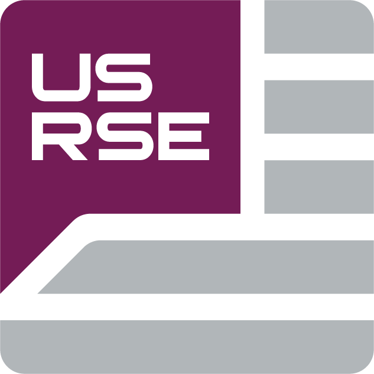
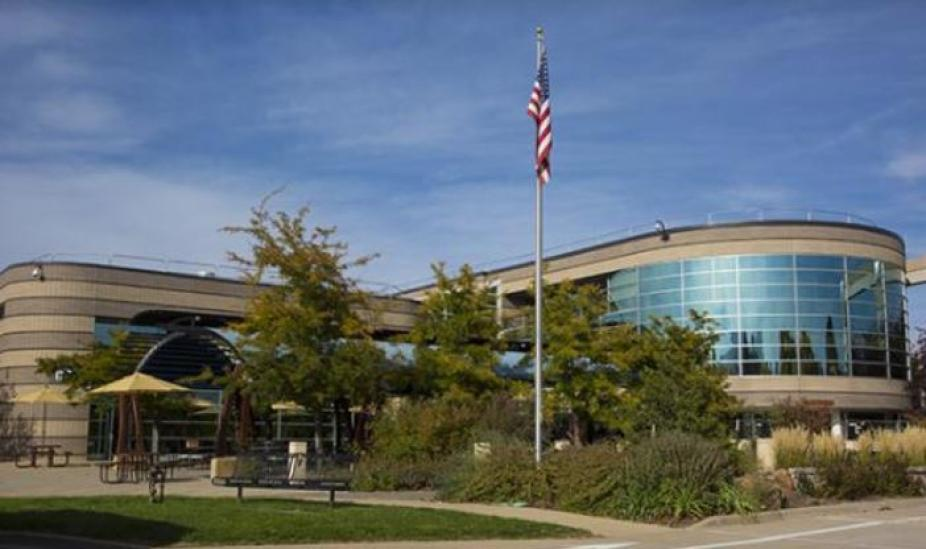

<figure markdown="span">
    
    <figcaption>**From Legacy to Leading-Edge: Transforming Software Design in
    Science to Meet Tomorrow’s Challenges**</figcaption>
</figure>

    

        
<b>When:</b>

        
7-10 April, 2025

    

    

        
<b>Where:</b>

        
Boulder, CO and virtual

    

The annual Improving Scientific Software Conference brings together software
engineers, scientists, developers - any individuals with an interest in
scientific software design - to share novel experiences and best practices,
develop connections across divisions and institutions, and advance our
community.

The pace of change for those using and developing scientific software
accelerated in ways we have not seen in some time. Increasingly, tools and even
models from the private sector are crossing over into our science domains. Large
hyperscalers are driving changes in hardware priorities and we must adapt. And
generative AI developments invite both potential and uncertainty for both
developers and scientists.

The 2025 Improving Scientific Software Conference is organized by the UCAR
Software Engineering Assembly (SEA).

### Audience

The conference is for staff and students at research institutions, universities,
and in industry who are interested in learning and discussing the latest
developments and practices in scientific software. Those working in the
geosciences will likely find it most relevant.  However, anyone who finds the
agenda beneficial to them is welcome to attend even if they do not fit the
category previously stated.

### Sponsors

The 2025 Improving Scientific Software Conference has received supplemental
support through a [US-RSE Community and Travel
Funds](https://us-rse.org/community-funds/) grant. This grant has
enabled us to provide additional funding for students wishing to attend our
Conference. We highly encourage ISS attendees to check out the [US-RSE
organization](https://us-rse.org) for additional resources relevant to
research software engineering.

    

If your organization would like to sponser the ISS Conference in the future,
please reach out to the [ISS committee](mailto:iss_committee@ucar.edu) to
discuss funding opportunities.

## Registration and Logistics

Registration is now open for the conference. We offer in-person and virtual
registration - both types provide access for all four days of the conference. We
do not offer single-day registration.
 <figure markdown="span">

| Type      | Registration Deadline  | Price |
| --------- | ---------------------- | ----- |
| In-person | 11:59 PM MT - March 21 | $300  |
| Virtual   | 11:59 PM MT - April 3  | $50   |

[Registration Portal](https://www.eventsquid.com/event.cfm?id=27124){ .md-button }
</figure>

*If you are a student who was selected for registration support, we will send
you an email with details on how to register shortly.*

### Venue

<iframe
src="https://www.google.com/maps/embed?pb=!1m18!1m12!1m3!1d1038.2117474002214!2d-105.24629888084337!3d40.0314961030162!2m3!1f0!2f0!3f0!3m2!1i1024!2i768!4f13.1!3m3!1m2!1s0x876bee7374b17ef3%3A0xc4f7d4cd1d6b5ef!2sNCAR%20%26%20UCAR%20Center%20Green%20Campus%20(CG)!5e1!3m2!1sen!2sus!4v1739918181255!5m2!1sen!2sus"
width="400" height="300" style="border:0;" allowfullscreen="" loading="lazy"
referrerpolicy="no-referrer-when-downgrade"></iframe>

NSF NCAR Center Green Campus  
3080 Center Green Drive  
Boulder, CO 80301

### Lodging

There are a multitude of great lodging options across Boulder. We do offer a
limited number of rooms at the [Residence Inn
Boulder](https://www.marriott.com/en-us/hotels/vbocg-residence-inn-boulder/overview/?scid=f2ae0541-1279-4f24-b197-a979c79310b0),
conveniently located across the street from the conference venue.

 <figure markdown="span">
    [Book Group Rate Lodging](https://www.marriott.com/event-reservations/reservation-link.mi?id=1739378354061&key=GRP&guestreslink2=true&app=resvlink){ .md-button }
    <figcaption>**125.00 USD per night  
    Last Day to Book : Wednesday, March 19, 2025**</figcaption>
</figure>

## Submitting an Abstract

!!! info "Submission Types"
    === "Talks"
        Talks will be allocated 20 minutes, with 15 minutes for the talk itself
        and 5 minutes for questions.
    === "Tutorials"
        Tutorials will be allocated between 1-4 hours; we will balance the
        request of the submitters along with the available of time in the
        program.
    === "Panels"
        Panels will be 1 hour. It is expected that panel submitters will
        identify and collaborate with 2-4 panelists.

We welcome any abstracts related to improvements in scientific software,
particularly those focused on the following topics:

- Staying up to date with modern trends in RSE
- AI/ML, including its use in software development
- Community and legacy software development and modernization
- Improving the accessibility and usability of code bases to reach larger
  audiences (documentation, Jupyter notebooks, etc.)
- Scientific data analysis or visualization software
- Software development for HPC, accelerators, or any other non-standard hardware
  architectures
- Software management, both technical (e.g. CI/CD) and personnel-oriented (e.g.
  managing a team of developers)
- Continuously updating code bases to keep up with evolving background science;
  how innovations in science drive software development

We also strongly encourage abstracts from student and early-career participants
who might be interested.

 <figure markdown="span">
    <figcaption>**Abstract submission has now closed.**</figcaption>
</figure>

### Student Submission Support

Registration, travel, and lodging support will be available for a select number
of accepted student submissions. Any undergraduate or graduate student
submitting any type of abstract is eligible for this support. During review,
abstracts will be categorized into one of three outcomes:

* Accepted with registration and travel support
* Accepted without travel support
* Rejected

If a student submission is accepted without travel support, the submitter is
still encouraged to attend in-person if possible or virtually. If you have any
questions about student submission assistance, please reach out to the
[conference committee by email](mailto:iss_committee@ucar.edu).

### Proceedings

The ISS 2025 Conference will be using Jupyter Notebooks for proceedings again
this year. For those who are unfamiliar, Jupyter Notebooks allow for both static
representation of text, code, and equations using Markdown and HTML as well as
interactive execution of commands with a selected language kernel (interpretor).
This format provides authors with more tools to present their work and allows
readers the opportunity to interact with your code or science in ways not
possible with traditional text-only proceedings.

**Useful resources for authors:**

- [Instructions for creating an ISS notebook
  proceeding](https://ucar-sea.github.io/SEA-ISS-Template/submission-guidelines.html)
- [Example notebook 1](https://ucar-sea.github.io/SEA-ISS-Template/notebooks/notebook-template.html)
- [Example notebook 2](https://ucar-sea.github.io/SEA-ISS-Template/notebooks/example_2/notebook-example2_part1.html)

We expect authors to submit proceedings by the end of the Conference week (11
April, 2025). This timing will allow us to offer an office hour during the
conference to provide assistance to authors who want it.

If you have any questions, please email the [ISS Proceedings
committee](mailto:iss_proceedings@ucar.edu).

## Code of Conduct

UCAR and NSF NCAR are committed to providing a safe, productive, and welcoming
environment for all participants in any conference, workshop, field project or
project hosted or managed by UCAR, no matter what role they play or their
background.

<!---
This page is unfortunately down, so will leave this as a comment for now...

**All participants are required to abide by this [Code of
Conduct](https://www.ucar.edu/who-we-are/ethics-integrity/codes-conduct/participants).**
-->
