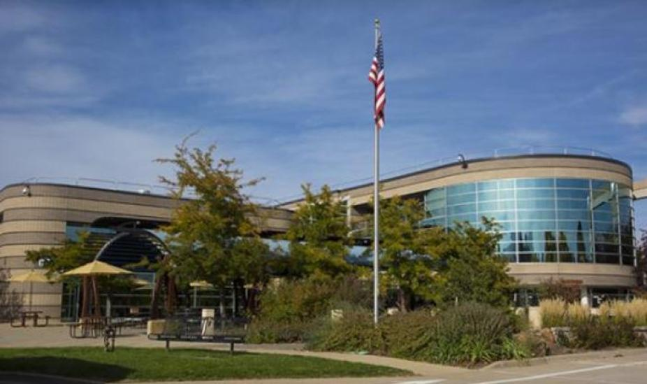

<figure markdown="span">
    
    <figcaption>**Maintaining the Joy of Software Development**</figcaption>
</figure>

    

        
<b>When:</b>

        
6-9 April, 2026

    

    

        
<b>Where:</b>

        
Boulder, CO and virtual

    

The annual Improving Scientific Software Conference brings together software
engineers, scientists, developers - any individuals with an interest in
scientific software design - to share novel experiences and best practices,
develop connections across divisions and institutions, and advance our
community.

The scientific software ecosystem is experiencing changes unlike any in
recent times. Large language models are revolutionizing the software development
process, but understanding how to use them effectively and ethically remains a
major difficulty. And software sustainability is less certain than ever, given
the disruptions we've seen to previously reliable funding streams. As always,
these challenges bring with them corresponding opportunities, and in pursuing
such opportunities, we can seek to *maintain the joy of software development*.

### Audience

The conference is for staff and students at research institutions, universities,
and in industry who are interested in learning and discussing the latest
developments and practices in scientific software. Those working in the
geosciences will likely find it most relevant.  However, anyone who finds the
agenda beneficial to them is welcome to attend, even if they do not fit the
category previously stated.

### Sponsoring ISS 2026

The 2026 Improving Scientific Software Conference is organized by the UCAR
Software Engineering Assembly (SEA) and funded by UCAR and NSF NCAR. We also
welcome external sponsors to provide support to ISS in exchange for increased
visibility and opportunities to engage with our audience. We anticipate 75-125
attendees that include NSF NCAR staff and students and professionals at research
institutions, universities, and industry that are interested in learning and
discussing the latest developments and practices in scientific software.

The following support levels are available:

=== "Software Innovators - $2,500"
    - 2 free registrations for the ISS Conference
    - 5-minute vendor presentation during lunch
    - Display of logo on signage during all networking events at the conference
    - Recognition of sponsor support in social media posts
    - Display of logo on this page
    - Space for promotional items distribution at the conference
=== "Dynamic Developers - $1,000"
    - 1 free registration for the ISS Conference
    - Display of logo on signage during all networking events at the conference
    - Recognition of sponsor support in social media posts
    - Display of logo on this page
=== "Community Collaborators - $500"
    - Display of logo on signage during all networking events at the conference
    - Recognition of sponsor support in social media posts
    - Display of logo on this page

This information is also available in [PDF
format](../../assets/iss2026_sponsorship.pdf) for your convenience. Should you
have any questions, need assistance, or wish to discuss, please contact [Sarah
Swanson](mailto:sswanson@ucar.edu), Executive Director of the Friends of the
National Center, or [Jesse Nusbaumer](mailto: nusbaume@ucar.edu), ISS 2026
Chair.

To proceed with a sponsorship, please fill out [this
form](https://universitycorporationforatmospheri.my.site.com/forms/s/).

## Registration and Logistics

Registration is now open for both in-person and virtual attendance to ISS 2026.
Both registration types provide access for all four days of the conference. We
do not offer a single-day registration option.

 <figure markdown="span">

| Type      | Registration Deadline  | Price |
| --------- | ---------------------- | ----- |
| In-person | 11:59 PM MT - March 20 | $300  |
| Virtual   | 11:59 PM MT - April 3  | $50   |

[Registration Form](https://www.eventsquid.com/event.cfm?id=31086){ .md-button }
</figure>

### Lodging

As in past years, we will be offering access to a block of hotel rooms at a
preferred conference rate at the walking-distance [Residence Inn
Boulder](https://www.marriott.com/en-us/hotels/vbocg-residence-inn-boulder/overview/?scid=f2ae0541-1279-4f24-b197-a979c79310b0).
Check back for more details soon!

### Venue

!!! note "Change in Venue"
    As of January 21, 2026 the ISS Committee has elected to shift the conference
    venue from the NSF NCAR Mesa Lab to the Center Green Campus. A change in
    construction schedule allowed for this pivot, which provides easier
    logistics for attendees.

<iframe
src="https://www.google.com/maps/embed?pb=!1m18!1m12!1m3!1d8257.903603950961!2d-105.24822382310059!3d40.03196077150409!2m3!1f0!2f0!3f0!3m2!1i1024!2i768!4f13.1!3m3!1m2!1s0x876bee7374b17ef3%3A0xc4f7d4cd1d6b5ef!2sNCAR%20%26%20UCAR%20Center%20Green%20Campus%20(CG)!5e1!3m2!1sen!2sus!4v1769028749911!5m2!1sen!2sus"
width="600" height="300" style="border:0;" allowfullscreen="" loading="lazy"
referrerpolicy="no-referrer-when-downgrade"></iframe>

This year's ISS Conference will be held at UCAR's Center Green Campus in
Boulder, CO, providing easy walking-distance access from the local conference
hotel.

UCAR Center Green Campus  
3090 Center Green Dr.  
Boulder, CO 80301

## Submitting an Abstract

!!! info "Submission Types"
    === "Talks"
        Talks will be allocated 20 minutes, with 15 minutes for the talk itself
        and 5 minutes for questions.
    === "Tutorials"
        Tutorials will be allocated between 1-4 hours; we will balance the
        request of the submitters along with the available of time in the
        program.
    === "Panels"
        Panels will be 1 hour. It is expected that panel submitters will
        identify and collaborate with 2-4 panelists.

We welcome any abstracts related to improvements in scientific software,
particularly those focused on the following topics:

- Use of AI in software development
- Collaborative efforts spanning groups within institutions
- Writing code that is easy for new contributors to understand
- Better practices for writing and maintaining documentation
- Effective approaches to prioritize and enhance community software maintenance
- Strategies for demonstrating legacy software value in a changing landscape
- What can software engineers, research software engineers, and scientists learn
  from each other?

We also strongly encourage abstracts from student and early-career participants
who might be interested.

 <figure markdown="span">
    <figcaption>**Abstract submission has now closed.**</figcaption>
</figure>

### Student Submission Support

Registration, travel, and lodging support will be available for a select number
of accepted student submissions. Any undergraduate or graduate student
submitting any type of abstract is eligible for registration support. However,
**travel and lodging support are limited to U.S. students only.** During review,
abstracts will be categorized into one of three outcomes:

* Accepted with registration and travel support
* Accepted without travel support
* Not accepted

If a student submission is accepted without travel support, the submitter is
still encouraged to attend in-person if possible or virtually. If you have any
questions about student submission assistance, please reach out to the
[conference committee by email](mailto:iss_committee@ucar.edu).

### Proceedings

We will accept traditional paper submissions this year for publication alongside
a new option to upload slides and supporting materials such as computational
notebooks (with or without a corresponding paper) to a conference collection on
Zenodo.  Paper submissions will be due April 24th, 2026 and will undergo a
subsequent review process. Slides and computational notebooks should be
submitted to Zenodo by the end of the conference.

If you have any questions, please email the [ISS Proceedings
committee](mailto:iss_proceedings@ucar.edu). We plan to host office hours during
the conference if you have questions before the submission deadline.

## Code of Conduct

UCAR and NSF NCAR are committed to providing a safe, productive, and welcoming
environment for all participants in any conference, workshop, field project or
project hosted or managed by UCAR, no matter what role they play or their
background.

**All participants are required to abide by this [Code of
Conduct](https://www.ucar.edu/who-we-are/ethics-integrity/codes-conduct/participants).**
