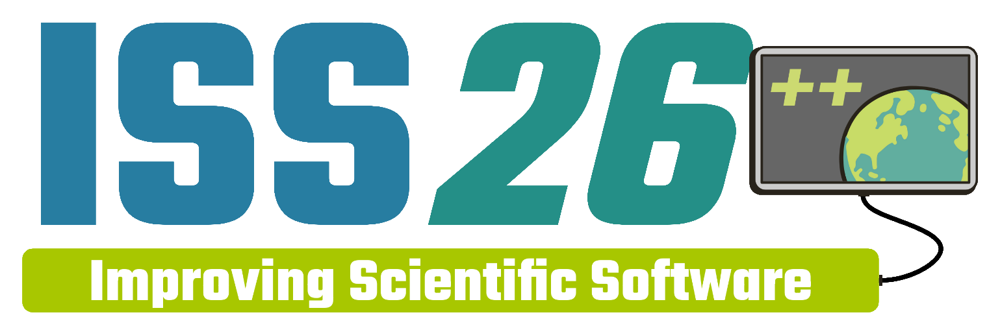

<figure markdown="span">
    
    <figcaption>**Maintaining the Joy of Software Development**</figcaption>
</figure>

## Online Program

=== "Monday, April 6"
    

        

            
<b>8:30 AM</b>

            

            

    ??? info cell "Opening Remarks"
        

        

        

            
<b>8:40 AM</b>

            
Keynote (TBD)

            

    ??? abstract cell "TBD"
        *TBD*
        

        

        

            
<b>9:50 AM</b>

            

            

    ??? info cell "Break"
        

        

        

            
<b>10:20 AM</b>

            
Jorge Bravo

            

    ??? abstract cell "MPAS-Viewer to explore MPAS Data on Its Native Unstructured Grid"

        *Jorge Humberto Bravo Mendez, with a background in atmospheric sciences and a master’s degree in hydrometeorology, is currently a PhD candidate at Stevens Institute of Technology (Hoboken, NJ). His research focuses on numerical modeling using MPAS over New York City Metro.*

        The Model for Prediction Across Scales Atmosphere (MPAS-A), an advanced atmospheric model designed to accurately represent weather systems at both regional and global scales. It makes use of a special unstructured mesh that resembles a honeycomb, allowing variable resolution across the globe. This allows MPAS-A to simulate the atmosphere in high resolution over specific regions, capturing small-scale weather phenomena such as thunderstorms, while maintaining lower resolution elsewhere to efficiently model large-scale atmospheric dynamics.

        While the unstructured honeycomb mesh offers flexibility and precision in modeling, it has a notable drawback. Although the data obtained from the MPAS-A model are stored in NetCDF format and can be considered a type of raster, their processing relies on correctly identifying vertices, edges, and centroids. As a result, they lack straightforward and efficient plotting methods, making rapid visual assessment more challenging.

        Although there are software tools (e.g. ParaView) that can handle and visualize unstructured meshes, they often come with a steep learning curve, which can become a barrier when quick progress is needed. Similarly, while certain programming languages and libraries support visualization, they come with their limitations. For instance, NCAR Command Language (NCL) has been discontinued. Although Python offers powerful libraries for working with unstructured data, they did not fully meet our needs during the evaluation and visualization work with data obtained from MPAS-A.

        Python is currently one of the most popular scripting languages for manipulating scientific data, such as NetCDF, and offers straightforward tools for data visualization. In this work, we introduce a new tool that was custom-built to display MPAS-A data rapidly and efficiently. This is an alternative to default functions that automatically generate triangulated meshes from unstructured data. Our approach also avoids the use of slow for-loops to create individual polygons. Instead, we plot MPAS-A data directly on its native grid, treating each data value as a cell. This approach not only enables interactive visualizations, such as animations or widgets for exploring variables over time, but also significantly reduces rendering time, making it well-suited for applications where rapid data display is essential.
        

        

        

            
<b>10:40 AM</b>

            
Rubaiat Islam

            

    ??? abstract cell "MPASdiag: Data Processing, Visualization and Analysis Toolkit for MPAS from Native Unstructured Mesh"

        *Rubaiat Islam (he/him) is a Scientist II at the NSF National Center for Atmospheric Research (NCAR) Mesoscale & Microscale Meteorology Laboratory. Besides this role, he is leading the development and maintenance of MPASdiag, and serving as a core member of the Earth System Data Science (ESDS) initiative at NSF NCAR. In his free time, Rubaiat enjoys hiking, photography, and exploring new technologies.*

        Model for Prediction Across Scales (MPAS) takes advantage of unstructured meshes and variable-resolution grids to provide accurate and efficient simulations, however, datasets from native unstructured meshes can be challenging to analyze and visualize using traditional tools designed for structured grids. In this talk, we present MPASdiag, an open-source Python package developed to facilitate the processing, analysis and visualization of MPAS model output from native unstructured meshes. Besides a powerful data processing engine powered by xarray and uxarray, MPASdiag provides an advanced visualization framework built on top of Matplotlib and Cartopy. MPASdiag visualization capabilities currently include the generation of 2-D surface plots, vertical cross sections, zonal and meridional averages, Hovmöller diagrams, and time series plots. The visualization framework is designed to be highly customizable, allowing users to tailor plots to their specific needs.

        To demonstrate the capabilities of MPASdiag, we will showcase several case studies including the visualization of 2-D and 3-D atmospheric variables from high-resolution MPAS simulations, batch processing of cycling MPAS forecast data to demonstrate the efficiency of command line interface, and the scalability of parallel processing engine to handle kilometer-scale MPAS data analysis from native unstructured meshes.
        

        

        

            
<b>11:00 AM</b>

            
Kyle Shores

            

    ??? abstract cell "Simulating atmospheric chemistry with web assembly"

        *Kyle has a background in both computer science and atmospheric sciences. He's interested in delivering useful scientific software that is user-friendly, well-tested, and just works. He enjoys cross-language development, working with students, and lots of coffee.*

        Are you interested in delivering scientific software to users without installation headaches or complicated setup? This talk will introduce WebAssembly, a technology that enables near-native performance for compiled languages directly in web browsers. We’ll demonstrate how, for the first time, NCAR atmospheric chemistry simulations can run nearly instantaneously in the browser using the MUSICA software library’s APIs. Whether you develop scientific tools or want to make complex models more accessible, you’ll learn what WebAssembly is, how it works, and how existing scientific code can be compiled to run in the browser. Join us to see how WebAssembly can simplify software delivery, engage more users, and help explain atmospheric chemistry concepts interactively.
        

        

        

            
<b>11:20 AM</b>

            
Guoqing Ge

            

    ??? abstract cell "HiFiYAML - A High-Fidelity YAML Parser That Preserves Formatting"

        *I am a research scientist working on improving NOAA weather analyses and forecasts through Modeling, Data Assimilation and Artificial Intelligence.*

        YAML is widely used in geophysical applications for configuration management and it provides a flexible and expressive data structure for defining detailed options. Usually YAML files are relatively small (typically a few hundred lines or fewer), users can easily edit them with standard text editors, provided that they carefully follow YAML’s strict indentation rules.

        In some cases, however, YAML files can grow to tens of thousands of lines, such as the final YAML files used by the Joint Effort for Data assimilation Integration (JEDI) software in an operation-like environment where hundreds of types of observations are assimilated. At this scale, YAML files become difficult to read, review, and edit, greatly increasing the likelihood of user errors. These errors can reduce scientific productivity and slow research progress.

        PyYAML is a YAML parser and emitter for Python. It allows users to load YAML files into Python data structures (e.g., dictionaries, lists, and scalars) and modify their contents programmatically. However, PyYAML is not round-trip safe: loading a YAML file into Python objects and then dumping them back to a new YAML file does not preserve the original formatting. Comments are lost, anchors may be renamed, and key ordering can change. As a result, long YAML files generated or modified by PyYAML are difficult to read, review, diff, or debug.

        HiFiYAML (High-Fidelity YAML parser; https://pypi.org/project/hifiyaml/
        ) provides an alternative YAML parser. HiFiYAML preserves the original YAML structure and formatting, including comments, anchors, aliases, and key order. This enables users to programmatically modify very large YAML files easily with confidence that the original formatting will be retained. By reducing errors and improving readability and usability, HiFiYAML can significantly accelerate scientific workflows. The design and usage of HiFiYAML will be discussed at the meeting.
        

        

        

            
<b>11:40 AM</b>

            
Haiying Xu

            

    ??? abstract cell "Exploring Memory Tracking and Debugging for Large Scientific Simulations"

        *Haiying Xu is the senior software engineer in the Applied Computational Science Section (ACS) at the National Center for Atmospheric Research. She is the technical lead on the scientific computing Input/Output performance for the ACS, focused on open source, reproducible, and scalable solutions for the geosciences community.*

        Large Earth science simulations are increasing their spatial resolution from hundreds of kilometers to a kilometer scale, making memory capacity and memory performance critical constraints. In many large-scale applications, excessive memory usage can result in the need to undersubscribe nodes, thereby increasing the overall job resource requirements.
        In this work, we explore the use of several tools to diagnose memory leaks and excessive memory usage in large simulation workflows. While they provide detailed allocation traces, they are often difficult to apply to full production runs and can introduce substantial overhead. As a result, they may fail to capture memory behavior at realistic scales.
        To address this limitation, we investigate a complementary approach based on recording virtual memory usage, including peak virtual memory and memory growth over time across all MPI ranks. These lightweight techniques allow us to analyze memory behavior throughout the entire workflow with minimal perturbation. Together, these tools provide practical insight into where and how memory is consumed.
        

        

        

            
<b>12:00 PM</b>

            

            

    ??? info cell "Lunch"
        

        

        

            
<b>1:00 PM</b>

            
Negin Sobhani

            

    ??? abstract cell "The AI Transformation of Earth System Modeling: Opportunities, Challenges, and What Comes Next"

        *Negin Sobhani is an HPC Consultant at the National Center for Atmospheric Research (NCAR), where she supports researchers in optimizing computational workflows for Earth system modeling and prediction. Her expertise spans high-performance computing, distributed training strategies, and AI/ML applications in geosciences. She works closely with the scientific community to improve GPU utilization, scalability, and performance of large-scale machine learning workflows on HPC systems.*

        The integration of Artificial Intelligence (AI) and Machine Learning (ML) into Earth System Science (ESS) has the potential to substantially transform the way we conduct science, from modeling Earth system processes to data analysis and discovery, to decision-making and support. AI/ML techniques such as online bias correction, parameter estimation, ML-based parameterizations, model component emulators, and uncertainty quantification enhance models and allow for more efficient, accurate, and scalable simulation of complex processes that are traditionally challenging and computationally expensive for Earth System Models (ESMs) to capture.

        In recent years, fully data-driven AI/ML emulators have emerged that emulate the atmosphere (and other Earth components) as a whole, offering the capability to generate global medium-range weather forecasts in minutes on a single GPU—a significant improvement over the computational time required by previous Numerical Weather Prediction (NWP) models. Hybrid modeling approaches integrate physics-based models with data-driven AI/ML components, leveraging the strengths of both paradigms to improve predictive accuracy, enhance model interpretability, and reduce computational costs while maintaining physical laws and improving representation of subgrid-scale processes. Additionally, AI/ML methods are advancing Data Assimilation (DA) techniques, inverse problems, and ensemble forecasting. Beyond modeling, Large Language Models (LLMs) are redefining scientific workflows by enabling researchers to interact with complex datasets through natural language queries and to extract features from multidimensional data, such as identifying ocean eddies in satellite imagery or detecting precursors to extreme events.

        In this talk, we will examine how AI/ML is reshaping Earth system modeling and explore the implications for cyber-infrastructure as data-driven and physics-based approaches converge. We discuss the technical advances enabling this transformation: differentiable programming frameworks, tools for coupling neural networks with Fortran-based codes, and architectures that encode physical priors. We also consider the challenges ahead—ensuring conservation properties, maintaining stability across timescales, generalizing to extreme events outside training distributions, and developing evaluation frameworks that assess physical fidelity alongside forecast skill.  To fully realize the potentials of these technologies in ESM, it is important that the supporting infrastructure, including GPU-enabled HPC, AI-ready data pipelines, accessible inference workflows, and workforce training, evolve together with the scientific methods themselves.
        

        

        

            
<b>1:20 PM</b>

            
Shawn Polson

            

    ??? abstract cell "Creating AI Agents for PyHC with Claude Code and Codex"

        *Shawn Polson is a software engineer who got his Masters in Computer Science from CU Boulder in 2020. He has worked at LASP since 2015. He is the Tech Lead of the Python in Heliophysics Community (PyHC) and works on the SUDA SDC for NASA's Europa Clipper. He also serves on LASP's AI Steering Committee.*

        This talk explores the practical application of agentic AI within the Python in Heliophysics Community (PyHC), specifically focusing on Anthropic's new command-line tool, "Claude Code." Claude Code—and competing tools like Codex CLI and Gemini CLI—operate directly in the terminal, allowing for the creation of agents that can navigate code repositories, execute commands, and autonomously manage complex workflows. We will show how easy it is to set up these agents and what PyHC's Tech Lead has been doing with them lately.

        The talk highlights three functional prototypes developed to assist the PyHC ecosystem: (1) the "PyHC Standards Evaluator," an agent that automates the grading of packages against PyHC's development standards; (2) the "HSSI Metadata Extractor," which parses repositories to extract the metadata necessary to submit them to the Heliophysics Software Search Interface (HSSI) website; and (3) "PyHC-Chat," an agent designed to understand PyHC and its nearly 100 packages, answering questions about the community and codebases while helping users install packages, write code with them, and even draft executable papers.
        

        

        

            
<b>1:40 PM</b>

            
Sandra Gesing

            

    ??? abstract cell "RSEs in the Age of AI: Professional Roles, Responsibilities, and Change"

        *Sandra Gesing is the Executive Director of the United States Research Software Engineer Association (US-RSE) and a senior researcher at the San Diego Supercomputer Center in distributed computing and science gateways. Her work focuses on research software sustainability, workforce development, and the design of community-driven cyberinfrastructure that supports reproducible and trustworthy science. She is deeply involved in national and international initiatives at the intersection of research software, data, and artificial intelligence, including efforts to broaden access to advanced computing and AI resources.*

        Generative AI is fast becoming embedded in the daily work of Research Software Engineers (RSEs). AI-assisted coding tools, automated workflow generation, and model-driven analysis promise efficiency gains, while also raising questions about how professional roles may shift. Public narratives often frame AI either as a productivity miracle or as a force that will replace technical expertise altogether. Both views underestimate the complexity of research software work and the professional judgment it requires.
        This talk argues that the coming years will be defined by a hybrid mode of practice in which RSEs work alongside AI systems rather than being displaced by them. As AI-generated components enter research pipelines, new responsibilities emerge around validation, reproducibility, provenance, and transparency. Automated outputs must be interpreted, tested, and integrated within scientific and institutional contexts. These tasks require not only technical skill, but also an understanding of research culture, risk, and accountability.
        In this evolving landscape, the professional value of RSEs increasingly lies in stewardship rather than volume of code written. RSEs help ensure that AI-augmented research remains reliable, trustworthy, and reusable by shaping workflows, supporting users, and contributing to shared norms around responsible AI use. Over the next five years, changes in tools will continue, but the need for skilled professionals who can guide, govern, and sustain research software will grow.
        

        

        

            
<b>2:00 PM</b>

            
Anissa Zacharias

            

    ??? abstract cell "You don’t need to use AI to be a good software engineer."

        *Anissa is a software engineer in the Computational and Information Systems Lab (CISL) at NSF NCAR. Her background is in computational mathematics and science and her current work focuses on creating computational and visualization tools for earth systems science on the GeoCAT team.*

        With claims like “large language models are revolutionizing software development” everywhere, it might feel developers need to integrate LLM products into their workflows or risk falling behind. As we navigate questions about how to use AI responsibly, the case for rejection is often overlooked.

        This talk will focus on the inherent limitations of LLM products by examining the foundational computational concepts behind modern AI and present a case for rejecting these tools in scientific software development.
        

        

        

            
<b>2:20 PM</b>

            

            

    ??? info cell "Break"
        

        

        

            
<b>2:50 PM</b>

            
Melis Fidansoy

            

    ??? abstract cell "Landslide Risk Assessment using Vision-Language Models: A California Case Study"

        *I am a second-year PhD candidate focused on large-scale, software-centric geohazard risk analysis. Additionally, I am working on designing and implementing scalable scientific software for AI-driven environmental hazard analysis and infrastructure resilience and risk assessment for large-scale road networks. My work emphasizes reproducible, performance-aware pipelines that integrate spatiotemporal modeling, high-performance computing, and large-scale geospatial data processing. Moreover, it includes landslide susceptibility modeling, interactive web-based decision support systems, distributed workflow automation, and an open-source, map-based framework that applies vision–language models for spatial reasoning and inference under partial environmental data availability. At ISS 2026, I look forward to engaging with the community on sustainable scientific software practices, modular system design, and the role of interpretable AI tools in environmental decision-support systems.*

        Landslides are a geohazard that affects infrastructure systems, public safety, and climate resilience, particularly in regions such as California, where wet-drought cycles are experienced. They pose threats to transportation infrastructure, including highways and local road networks, where slope failures can cause roadway closures, structural damage, and prolonged service disruptions that delay emergency response and economic activity.

        This talk will introduce an open-source, map-based framework that integrates geospatial datasets, including rainfall, normalized difference vegetation index (NDVI), slope, geology, and historical landslide inventories, into a region-focused landslide risk assessment. For a case study, statewide data from California are processed and visualized to produce high-resolution maps that capture the spatiotemporal environmental conditions associated with landslide occurrence. These maps are used as inputs to vision–language models (VLMs) for spatial reasoning. The framework uses open-source VLMs to perform landslide risk inference under partial data availability. In this setting, NDVI, rainfall, slope, and geology maps from specific time periods are provided as inputs, and VLMs are prompted to identify regions with high landslide susceptibility and to predict high-risk landslide hotspots beyond the input time span.

        The framework performance is evaluated by comparing predicted high-risk regions against documented landslide events. Research results suggest that VLMs can capture meaningful patterns associated with subsequent landslide activity and demonstrate the promise of vision–language modeling as a flexible, interpretable tool for geohazard analysis. In addition to the landslide hazard presented here, the software framework also enables broader use in environmental risk assessment and decision support.
        

        

        

            
<b>3:10 PM</b>

            
Lee Liming

            

    ??? abstract cell "Globus Auth: Federated Identity and Access Management for Scientific AI Systems"

        *Lee Liming is the Director of Professional Services (Globus) at the University of Chicago. In 20+ years with the Globus team, Lee has contributed to national research initiatives including computing (NSF’s TeraGrid, XSEDE, ACCESS, DOE’s American Science Cloud), bioinformatics (NIH’s BIRN and CFDE, ARPA-H’s APECx), and climate (DOE’s ESGF2-US).*

        Globus Auth is the cornerstone authentication and authorization service for the Globus data management ecosystem, designed and operated by the University of Chicago to address the evolving needs of the global research community. Over the past decade, our team has continually enhanced Globus Auth, prioritizing features that facilitate multi-institutional scientific collaborations with the robust assurance controls necessary for secure scientific environments.

        In response to the rapid rise of artificial intelligence, large language models (LLMs), and autonomous agent workflows, we have expanded Globus Auth to support secure API access, non-human agents, and self-service configuration. This ensures that AI-driven scientific discovery software can maintain the strict security requirements demanded by modern research, while still being flexible and scalable for collaborative computational science.

        The talk will focus on Globus Auth’s role in the newly-launched Genesis Mission: a national effort to drive scientific discovery, national security, and energy innovation through AI and high-performance computing. Specifically, we will show how modern, AI-driven discovery applications are already using Globus Auth to gain secure access to data and computational resources provided by national facilities.
        

        

        

            
<b>3:30 PM</b>

            
Damian Rouson

            

    ??? abstract cell "Data reduction and surrogate-model training for cloud microphysics with Fiats"

        *Damian Rouson is a Senior Scientist and the Group Lead for the Computer Languages and Systems Software (CLaSS) Group at Berkeley Lab.  He leads several opens-source software projects, including the Fiats deep learning library, the Julienne correctness-checking framework, the Formal mimetic abstraction language, and the Caffeine parallel runtime library.  He holds a B.S. from Howard University and a M.S. and Ph.D. from Stanford University, all in mechanical engineering.*

        This talk cover data analyis and nueral-network training using two demonstration applications in the Fiats deep learning library. [1]  One application computes histograms of intput and output data from a cloud microphysics model in the Intermediate Complexity Atmospheric Research (ICAR) model. [2] The second application trains a nueral-network surrogate for an atmospheric cloud microphysics model requires processing large

        Training a microphysics surrogate requires processing large data sets in which the vast majority of the data correspond to quiescent conditions.  When the predicted model output variables include time derivatives of the potential temperature, specific humidity, and the cloud, rain, and snow water content, greater than 99.9% of the values lie near zero. Moreover, the probability distribution of these variables fall nine decades, mostly monotonically, over the range of predicted values. Filtering the uninteresting, near-zero derivative values thus progressively leaves a filtered data set that still considerably over-samples values near zero; whereas, not filtering greatly increases training costs and over-samples the least interesting output values. This talk will explore the utility of a sampling strategy that trains on progressively larger samples of the training data.  The samples are chosen to flatten the phase-space in the manner of an information-entropy-maximizing distribution.  The talk will examine the extent to which this strategy accelerates convergence.
        

        

        

            
<b>3:50 PM</b>

            
Negin Sobhani

            

    ??? abstract cell "Benchmarking and Optimizing AI/ML Workflow Performance for Earth System Sciences"

        *Negin Sobhani is an HPC Consultant at the National Center for Atmospheric Research (NCAR), where she supports researchers in optimizing computational workflows for Earth system modeling and prediction. Her expertise spans high-performance computing, distributed training strategies, and AI/ML applications in geosciences. She works closely with the scientific community to improve GPU utilization, scalability, and performance of large-scale machine learning workflows on HPC systems.*

        As Artificial Intelligence (AI) and Machine Learning (ML) become essential tools for Earth system modeling and prediction, the community faces a growing challenge: how to objectively measure and compare the computational performance of AI/ML workflows across diverse hardware configurations and software stacks. Without standardized performance benchmarks, researchers cannot reliably identify bottlenecks, evaluate optimization strategies, or make informed decisions about resource allocation on high-performance computing systems.

        This presentation introduces a benchmarking initiative focused on quantifying the computational performance of AI/ML workflows for geoscientific applications. We define a suite of standardized metrics capturing GPU utilization, memory bandwidth, I/O throughput, inter-node communication efficiency, and scaling behavior across multi-GPU and multi-node configurations. The benchmark suite includes representative workloads spanning common model architectures and dataset sizes encountered in Earth System Sciences. 

        We present baseline results demonstrating how performance varies with different data loading strategies, parallelization approaches, mixed-precision configurations, and communication backends. These benchmarks reveal where workflows typically underperform, whether due to data starvation, memory pressure, or communication overhead. 

        By establishing open, reproducible performance benchmarks in the community, the focus should be on enabling researchers to diagnose inefficiencies in their own workflows, compare infrastructure options, and track improvements over time. Attendees will gain practical guidance on methods to maximize hardware utilization and reduce time-to-solution for large-scale geoscientific AI/ML training.
        

        

        

            
<b>4:10 PM</b>

            

            

    ??? info cell "Proceedings Office Hours"
        

        

    

=== "Tuesday, April 7"
    

        

            
<b>8:30 AM</b>

            

            

    ??? info cell "Opening Remarks"
        

        

        

            
<b>8:40 AM</b>

            
Keynote (TBD)

            

    ??? abstract cell "TBD"
        *TBD*
        

        

        

            
<b>9:50 AM</b>

            

            

    ??? info cell "Break"
        

        

        

            
<b>10:20 AM</b>

            
Carol Ruchti

            

    ??? abstract cell "Using GitHub Projects to manage Software Projects"

        *Carol Ruchti is Scientist at NCAR's Earth Observing Laboratory (EOL) where she manages the EOL Field Catalog which is a web based real-time data product tool used for atmospheric field campaigns. Due to her formal education in science, she's always trying to improve her software and continues to learn the best practices of software. Currently, she's try to create organizing software teams by taking more of a project management approach.*

        As software engineers, managing deadlines and scope across projects can be difficult. This is especially true for software teams working across multiple code repositories where integration across those repositories is required. Still, in simpler cases, creating a project management kanban board can feel intimidating for software teams since it often requires copying issues into another tool. More importantly, it can be hard to decide if spending the time to learn how to use these project management tools is worth the effort.

        With GitHub Projects, creating kanban boards, priority lists, and consolidating issues from multiple GitHub repositories is made easy. For the past few months, software engineers from different facilities in the National Center for Atmospheric Research’s Earth Observing Laboratory have been investigating the many features of GitHub Projects. These teams have been able to organize important issues into an easy-to-understand board, quickly assign issues to team members, and automate repeating tasks and task lists for upcoming projects. These features from GitHub Projects saved countless hours in meetings and helped create a framework to quickly reference work that has been completed over any specified time period, and allowed managers to efficiently monitor the status of all software projects without requiring direct input from software engineers.Thus, using GitHub Projects has provided project management principles to software teams in an easily digestible way, which simply makes software teams more efficient and organized in the future.
        

        

        

            
<b>10:40 AM</b>

            
Julie Prestopnik

            

    ??? abstract cell "Bridging Documentation, Maintenance, and Collaboration in Community Scientific Software"

        *Julie Prestopnik is a software engineer at the National Science Foundation National Center for Atmospheric Research (NSF NCAR) with more than two decades of experience developing and supporting community atmospheric science software. She leads software installation, documentation, and cybersecurity efforts for METplus and co-leads the community pillar for FastEddy, with a focus on improving documentation, workflows, and contributor experience. Julie is particularly interested in making complex systems easier to sustain through clear communication and collaborative practices.*

        Documentation and maintenance are critical infrastructure for community scientific software, yet they are often treated as secondary to code development. At the same time, community software is rarely built or sustained by a single static team, and practices are frequently implicit rather than documented. Sustainable community software depends on making documentation, maintenance, and collaboration explicit, repeatable, and visible. Drawing on over a decade of experience with the METplus verification software, recent restructuring work for the FastEddy Large-Eddy Simulation model, and emerging engagement with the NSF NCAR Community Software Facility (CSF), this talk presents practical lessons learned from working across projects and groups within NSF NCAR.

        The presentation will describe how METplus integrates documentation and maintenance directly into its development workflow using a Docs-as-Code approach, automated documentation builds, and structured development cycles. These practices support regular releases, transparent prioritization of bugfixes and security work, and ongoing compatibility maintenance across compilers, platforms, and HPC systems. Developer-facing documentation, such as the METplus Release Guide, has proven especially valuable for making complex processes reproducible and reducing reliance on institutional memory.

        The talk will also reflect on how some of these practices have been transferred from METplus to FastEddy and how they are informing discussions around co-design and code audits within the CSF. By documenting procedures explicitly and automating routine checks, teams can strengthen collaboration, improve continuity of work, and support the long-term sustainability of community scientific software.
        

        

        

            
<b>11:00 AM</b>

            
Primus Kabuo

            

    ??? abstract cell "Documentation as Infrastructure: A Practical Framework for Sustainable Scientific Software"

        *I'm a Senior Research Software Engineer at Purdue's RCAC, where I build tools, workflows, and systems that make research software more sustainable and usable. My background spans software engineering, startup leadership, and product-focused system design. At RCAC, I work on unified HPC operations portals, LLM-driven tooling, and practical frameworks that improve onboarding and long-term maintainability of research software. I'm especially interested in creating systems that help researchers and users work more efficiently and collaboratively.*

        Scientific software often fails not because of algorithms, performance, or infrastructure, but because teams cannot sustain the knowledge required to maintain it. As research groups grow and rotate, documentation becomes fragmented, outdated, or entirely absent—creating onboarding friction, duplicated effort, and long-term maintenance risk. At Purdue University’s Rosen Center for Advanced Computing (RCAC), I have worked across multiple research software and training projects to design and implement a centralized documentation strategy that treats documentation as shared infrastructure rather than a side task.
        This talk presents a practical, lightweight framework for building sustainable documentation systems in scientific software teams. I will share lessons learned from unifying documentation across HPC workflows, training pipelines, and collaborative development environments, including how to establish documentation ownership, structure contributor friendly content, and integrate automation to reduce maintenance overhead. I also discuss where AI assisted tools can responsibly support documentation work without compromising accuracy or reproducibility.
        Attendees will leave with actionable templates, governance patterns, and workflow recommendations that can be adopted by teams of any size. By reframing documentation as a core component of software sustainability, we can reduce technical debt, improve developer experience, and strengthen the long-term impact of scientific research.
        

        

        

            
<b>11:20 AM</b>

            
Melis Fidansoy

            

    ??? abstract cell "From Code to Comprehension: The Role of Design Diagrams in Interdisciplinary Geospatial Software"

        *I am a second-year PhD candidate focused on large-scale, software-centric geohazard risk analysis. Additionally, I am working on designing and implementing scalable scientific software for AI-driven environmental hazard analysis and infrastructure resilience and risk assessment for large-scale road networks. My work emphasizes reproducible, performance-aware pipelines that integrate spatiotemporal modeling, high-performance computing, and large-scale geospatial data processing. Moreover, it includes landslide susceptibility modeling, interactive web-based decision support systems, distributed workflow automation, and an open-source, map-based framework that applies vision–language models for spatial reasoning and inference under partial environmental data availability. At ISS 2026, I look forward to engaging with the community on sustainable scientific software practices, modular system design, and the role of interpretable AI tools in environmental decision-support systems.*

        Communication between team members is challenging, particularly in multi-disciplinaries teams. A common software engineering practice to bridge this gap is to use visual models to describe the goals and implementation of a software system. The most commonly used programming language is the Unified Modeling Language (UML). In this project, we present our experience with using UML Activity diagrams in a multi-disciplinary scientific computing project.
        To assess the effectiveness of software design documentation in bridging disciplinary knowledge gaps, we implemented a controlled evaluation approach within our research team. As geospatial research software grows in complexity and longevity, effective collaboration increasingly depends on a shared understanding of system structure rather than isolated code-level expertise. However, domain experts often lack the architectural visibility needed to contribute meaningfully to such systems.

        Our six-member team was divided into two cohorts: four members with formal training in software architecture and design diagrams (the "design team"), and two members with some computer science background but without prior exposure to design diagrams or knowledge of the application's internal structure (the "evaluation cohort").

        The design team developed comprehensive documentation including system architecture diagrams, data flow models, component interaction schemas, and an interpretive manual for backend of the application and data preprocessing/curation steps. Subsequently, we conducted a usability assessment where the domain expert cohort—who were familiar with the scientific objectives and data semantics of the application but lacked exposure to software design principles—was tasked with interpreting the documentation independently.

        This evaluation measured whether domain experts could: (1) comprehend the internal software architecture beyond surface-level functionality, (2) trace data pathways through system components, (3) identify integration points for potential extensions, and (4) articulate how modifications to one component would propagate through the system. We discuss our own experience with researchers without formal software engineering training to engage meaningfully with the technical infrastructure of geospatial applications, thereby facilitating collaborative development and reducing dependency on specialized technical personnel for system understanding and enhancement.
        

        

        

            
<b>11:40 AM</b>

            
Brenda Javornik

            

    ??? abstract cell "The Joy of Functional Programming"

        *Brenda currently develops software for NCAR Earth Observing Laboratory and has worked in commercial and open-source environments in a variety of domains.   Brenda has learned the value of a functional approach to software development  as the best way to deal with wild-type software.  Brenda is moving away from object-oriented programming and returning to earlier foundational experiences with functional programming.*

        Software, especially open source software is changing fast. How to keep up with the momentum?  How to keep your code relevant, adaptable, flexible, and show correctness?  Functional programming is a paradigm from as early as the 1950s,  with the development of LISP.  Based on Church’s lambda calculus, functional programming continued to develop with ML (1970s), and other languages, and is now encouraged  with AWS Lambda functions.

        This talk describes the tenets of functional programming including: avoiding side effects, first class functions, passing context, function composition, curried functions, closures, and continuations.   Also included are practical examples how to cover existing code with a functional veneer.   Let functional programming provide joy as you develop software and joy for those who may inherit your software.
        

        

        

            
<b>12:00 PM</b>

            

            

    ??? info cell "Lunch"
        

        

        

            
<b>1:00 PM</b>

            
Jenny Knuth

            

    ??? note cell "Rapid Usability Testing: it's easier than you think"

        *I am a frontend web developer at CU Boulder's Laboratory for Atmospheric and Space Physics (LASP) and a certified instructor for The Carpentries (i.e., Data Carpentries, Software Carpentries, etc.). I believe that incorporating user feedback while developing scientific software is a small investment that can pay off with greatly improved adoption and use.*

        This tutorial will teach participants the basics of rapid usability assessments—a good way to quickly identify areas for improvement in any user experience. Whether your users interact with your software product via command line or GUI, usability assessments can be a useful tool. These tests can be completed quickly and provide quantitative data like users’ success rates, speed, or satisfaction when completing a task. In this hands-on tutorial, participants will learn to define a task for moderated assessment, recruit and prepare for their study, conduct a usability assessment, and analyze results.

        There are no prerequisites for this tutorial.
        

        

        

            
<b>3:10 PM</b>

            

            

    ??? info cell "Break"
        

        

        

            
<b>3:40 PM</b>

            
Scot Breitenfeld

            

    ??? abstract cell "Securing the HDF5 Supply Chain via Safe-OSE"

        *Scot Breitenfeld is with The HDF Group and specializes in HPC applications using HDF5. He has implemented, troubleshot, and tuned HDF5 for a broad spectrum of HPC applications and third-party HDF5-based libraries across various machine architectures and parallel file systems.*

        HDF5 is a foundational data format used across high-performance computing, artificial intelligence, machine learning, and long-term data storage. Its widespread adoption makes HDF5 not only a crucial infrastructure but also a target for security threats.

        This presentation introduces NSF-Safe-OSE, an initiative to enhance the safety, security, and privacy (SSP) of the HDF5 ecosystem. We believe that achieving lasting security in scientific software requires more than just technical fixes; it necessitates a socio-technical infrastructure that provides clear guidelines, transparent processes, and pathways that empower diverse contributors to implement changes safely and confidently.

        We will share insights from our comprehensive audit, demonstrating how to transform threat modeling into actionable outcomes, which include a living risk register and enforceable policies. Our approach segments risks across various layers—from the file format and core library to the plugin ecosystem and the toolchain. Importantly, we will address emerging policy challenges faced by many scientific projects, such as securing dynamic plugin loading, managing Software Bill of Materials and provenance requirements, and reviewing contributions generated by AI.

        Beyond HDF5, this presentation offers reusable strategies for the broader scientific software community. We will illustrate how security engineering practices, including risk triage and verification, can be customized to address the unique constraints of scientific software—such as strict performance requirements, legacy compatibility, and reproducibility.

        We conclude by inviting the community to collaborate on high-impact initiatives, such as co-developing threat scenarios for cloud-based and regulated data, validating risk priorities, and partnering on trusted distribution models.
        

        

        

            
<b>4:00 PM</b>

            

            

    ??? info cell "Proceedings Office Hours"
        

        

    

=== "Wednesday, April 8"
    

        

            
<b>8:30 AM</b>

            

            

    ??? info cell "Opening Remarks"
        

        

        

            
<b>8:40 AM</b>

            
Keynote (TBD)

            

    ??? abstract cell "TBD"
        *TBD*
        

        

        

            
<b>9:50 AM</b>

            

            

    ??? info cell "Break"
        

        

        

            
<b>10:20 AM</b>

            
Maciej Manna

            

    ??? abstract cell "Always Measure: Analyzing Performance of Point-Particle DNS under Two-Way Momentum Coupling"

        *Quite recently, I joined the Polish Institute of Meteorology and Water Management (IMGW-PIB) as an employee and PhD candidate. My areas of interest include computational fluid mechanics, atmospheric turbulence, and collision statistics of cloud droplets. I recently returned to research after several years as a software engineer working in the industry and this experience significantly informs my approach to scientific software.*

        Computational efficiency matters a lot for scientific software, whether it allows
        to save valuable CPU-hours on HPC systems, to complete weather predictions
        within strict operational time windows, or simply to enable moderately complex
        research codes to run on personal laptops. Although we often rely on intuition
        to predict whether code will be fast or slow, such intuition is increasingly
        unreliable. Multiple layers separate the code we write from the instructions
        executed on modern hardware, and these layers are both complex and opaque.
        The intricacies of modern CPU architectures and the sophisticated
        transformations applied by optimizing compilers, among other factors, make it
        difficult to reason about performance a priori. Consequently, in communities
        where performance matters, one guiding principle is widely embraced: “Always
        measure.”

        This presentation first introduces fundamental performance assessment
        techniques—such as benchmarking and profiling—highlighting both their value
        and their common pitfalls. Several illustrative examples are presented where
        measurements contradict intuitive expectations. More importantly, we report a
        detailed performance analysis of a well-established direct numerical simulation
        (DNS) code used to study the influence of atmospheric turbulence on cloud
        droplet behavior. The software comprises two tightly coupled components: a
        pseudo-spectral fluid solver operating on an Eulerian regular box grid with
        periodic boundary conditions, and a Lagrangian module tracking individual point
        particles (droplets) that interact with the carrier flow. The code is optimized for
        massively parallel execution by employing a two-dimensional domain
        decomposition (into “pencils” or “columns”) to enable efficient three-
        dimensional Fast Fourier Transforms.

        The results of execution time measurements, collected using minimally intrusive
        manual instrumentation, are presented in various scenarios. The resulting data
        reveal notable discrepancies from an earlier performance study of the same code,
        primarily due to the use of substantially larger particle counts (to model regime
        where two-way momentum coupling is relevant). These discrepancies prompted
        a deeper investigation into how particle distribution across subdomains affects
        performance. Earlier assumptions of near-homogeneous particle distributions at
        this scale proved invalid, particularly when gravity introduces anisotropy in the
        system. In practical terms, this insight led to a simple two-line modification that,
        counterintuitively, orients gravity perpendicular to the subdomain “pencils.” This
        change was shown to speed up simulations by up to 30%.

        These findings underscore the necessity of measuring software performance and
        revisiting prior assumptions whenever numerical methods or physical
        parameters evolve. They also highlight additional challenges, more specific to
        research software, that further complicate performance reasoning, including
        distributed computation and the influence of physical parameters on the
        modeled system. Therefore, the imperative to “Always measure” is paramount to
        the development and use of scientific software.
        

        

        

            
<b>10:40 AM</b>

            
Deepak Kumar

            

    ??? abstract cell "WRF-Based High-Resolution Fire Weather Forecasting: Accuracy, Uncertainty, and Applications"

        *Dr. Deepak Kumar is a Research Scientist with the Atmospheric Sciences Group at Texas Tech University, Lubbock, USA, and was recently recognized among the World’s Top 2% Scientists for 2025 by Stanford University in collaboration with Elsevier. His multidisciplinary research spans Artificial Intelligence, Image Processing, Geomatics, and Geological and Engineering Sciences, with core expertise in Geospatial AI, Remote Sensing, and Climate Science. Previously, he contributed to the Atmospheric Sciences Research Center at the State University of New York at Albany, focusing on the Urban–Climate–Energy nexus and evidence-based resilience planning. Before his tenure in the United States, he served as an Assistant Professor at Amity University, Delhi-NCR, India, where he led two government-funded research projects and developed comprehensive expertise across the research lifecycle. He has authored over 80 peer-reviewed publications, co-edited six academic books with major international publishers, holds seven patents, and continues to advance transdisciplinary solutions for climate change, sustainable cities, and energy transitions.*

        Wildfire risk management increasingly relies on high-resolution, operational fire weather forecasts; however, converting numerical model outputs into actionable decision support remains a persistent challenge. This study critically evaluates the Weather Research and Forecasting (WRF) model’s capacity for hourly fire weather prediction, with particular emphasis on forecast accuracy, uncertainty quantification, and software engineering practices pertinent to scientific computing. WRF was configured at convection-permitting resolution to generate short-term forecasts of key fire weather variables like temperature, relative humidity, wind speed, and associated derived fire weather indices. Forecast performance was evaluated against ground-based observations using standardized verification metrics, including bias, root mean square error (RMSE), and correlation. Uncertainty was assessed through error propagation analysis and sensitivity testing. Results indicate strong model skill in reproducing the diurnal cycles and spatial variability of temperature and humidity, whereas wind fields exhibit greater uncertainty during rapidly evolving mesoscale events. Notably, derived fire weather indices demonstrate nonlinear error amplification, underscoring the necessity of robust uncertainty representation within decision-support frameworks. We document reproducible workflows, containerized deployment, and automated verification pipelines that enhance model reliability and operational readiness. The study further demonstrates visualization-driven dissemination of fire risk forecasts, with an emphasis on usability for fire management agencies. This work advances WRF-based fire weather forecasting by integrating rigorous evaluation with contemporary scientific software engineering practices, thereby promoting reproducible, scalable, and trustworthy computational science.
        

        

        

            
<b>11:00 AM</b>

            
Endalkachew Gelaw

            

    ??? abstract cell "Parallel Performance Characterization of WRF-Hydro using HPC Profiling Tools"

        *Endalkachew Gelaw is a PhD student in Civil and Environmental Engineering at South Dakota Mines. Leveraging prior experience in parallelizing distributed hydrological models for HPC architectures, he is undertaking a parallel performance characterization of WRF-Hydro using Intel profiling tools, complementing his primary research in flood inundation and hydrological modeling. He is particularly interested in research at the intersection of software development and hydrological and hydraulic modeling.*

        Understanding the performance characteristics of large-scale hydrological models is critical for enabling efficient flood forecasting and environmental modeling on high-performance computing (HPC) systems. WRF-Hydro is a widely used hydrological modeling framework that couples atmospheric and hydrologic processes to simulate flood inundation, streamflow, and watershed dynamics. However, as simulations scale to hundreds of cores and process larger spatial and temporal domains, performance bottlenecks—particularly related to communication, computation, and I/O—can limit scalability and increase time-to-solution.

        To investigate these challenges, I conducted a detailed performance study of WRF-Hydro using the standard test case provided by the model developers, running simulations on up to 100 cores. Results from Intel Application Performance Snapshot (APS) show that increasing the number of cores does not yield significant runtime improvements, indicating that WRF-Hydro is strongly MPI-bound and that inter-process communication is a primary bottleneck. Building on these results, I am using Intel HPC Performance Characterization Analysis to examine computational hotspots, memory usage, and communication patterns in greater detail.

        To capture the full behavior of WRF-Hydro under realistic workloads, I plan to extend the standard 11-day test case to a one-year simulation, allowing for a comprehensive view of performance when processing complete hydrometeorological datasets. In addition, I am designing a new large-scale test case with expanded spatial and temporal domains to explore scalability limits and identify potential bottlenecks under extreme scenarios.

        The next phase of the study will leverage Intel MPI Tuner to optimize MPI configurations and explore strategies to alleviate communication bottlenecks. By combining multiple profiling tools and testing across varying temporal and spatial scales, this work provides a comprehensive understanding of WRF-Hydro’s parallel performance. The presentation will share methodology, profiling results, preliminary findings, and insights into practical strategies for diagnosing and improving the performance of large-scale hydrological models on modern HPC architectures.
        

        

        

            
<b>11:20 AM</b>

            
Jian Sun

            

    ??? abstract cell "Status update of the StormSPEED project"

        *Jian Sun is currently a high-performance computing (HPC) software engineer from the NSF National Center for Atmospheric Research. His research focuses on the GPU porting and performance optimization of weather and climate models, which are originally implemented in Fortran or C++, and now offloaded to GPUs through various technologies such as CUDA, OpenACC, OpenMP target offload and ISO Fortran.*

        The divergent implementations of dynamical core (i.e., dycore) in various Earth System Models (ESMs) present a significant challenge to the climate science community for a consistent and fair comparison of scientific fidelity and computational efficiency. In addition, many dycores are built with rigid, hardware-specific optimizations, often supporting only CPUs or a single GPU vendor. This lack of portability and inherent vendor lock-in significantly restricts the deployment of dycores on modern, heterogeneous architectures composed of diverse CPU and GPU configurations.

        To address these systemic interoperability and portability challenges, the StormSPEED project was motivated and we successfully integrated the Energy Exascale Earth System Model (E3SM) non-hydrostatic spectral element dynamical core into the Community Atmosphere Model (CAM) framework. A pivotal aspect of this integration is the utilization of the C++/Kokkos library, which allows a single source codebase to perform efficiently with multiple hardware backends, including standard multi-core CPUs and various GPU architectures.

        This presentation will focus on the following three key areas:
        1. Baseline benchmark: A rigorous performance comparison of distinct dynamical cores within the identical CAM software infrastructure.
        2. High-resolution scalability: A performance analysis of the E3SM dycore at an ultra-high resolution (i.e., 7km and 3km), demonstrating its capability to run efficient simulations on both CPUs and GPUs.
        3. Cross-architecture portability: A showcase of the dycore’s deployment on both NVIDIA and AMD GPUs with minimal code modification.
        

        

        

            
<b>11:40 AM</b>

            
Ren Stengel

            

    ??? abstract cell "Evaluating the feasibility of language interoperability for atmospheric modeling using CAM parameterizations in E3SM"

        *Ren is a postdoctoral researcher in the Computational & Information Sciences Laboratory at NSF NCAR. She received her PhD from the University of Colorado Boulder in Computer Science where she studied performance portable solid mechanics implementations and computational efficiency. Her current research interests are focused on improving researcher access to computationally efficient scientific code bases and code modernization techniques.*

        Many atmospheric legacy codes are written in Fortran, which can make them challenging to port and run efficiently on newer high-performance computing systems. Additionally, as Fortran becomes less favored in the software engineering community, many researchers are starting to write physics models in modern languages such as Python, Python/JAX, and Julia. However, sharing progress and physics capabilities between these different language versions is non-trivial and rarely done in practice. We use EAMxx, the atmospheric model hosted in E3SM, to explore the feasibility of linking atmospheric parameterizations written in different languages into one system.
        EAMxx is written in C++/Kokkos offers direct interoperability support as well as code portability. We first describe the process of adding trivial parameterizations written in C++, Kokkos, Fortran, and Python in production configurations of EAMxx. We also take advantage of the recent work of converting CAM physics to be compliant with the Common Community Physics Package (CCPP); this recent development allows for CAM physics parameterizations to be utilized outside of CAM. We describe the process and effort to port the CCPP-enabled Kessler parameterization from CAM into EAMxx and provide preliminary results of the effort.
        

        

        

            
<b>12:00 PM</b>

            

            

    ??? info cell "Lunch"
        

        

        

            
<b>1:00 PM</b>

            
Kate Rasmussen

            

    ??? note cell "Idiomatic Vibe Testing with Julienne"

        *Katherine Rasmussen is a Computer Systems Engineer who applies Linguistics knowledge to developing, testing, and compiling programming languages for high-performance computing. She has experience in language grammars and abstract syntax trees (ASTs) for Fortran, C, and C++. She works in the Computer Languages and Systems Software (CLaSS) Group at Lawrence Berkeley National Laboratory where she contributes to the Julienne unit-testing and string-handling utility, the LLVM Flang Fortran compiler, and the Caffeine parallel runtime library. She does software archaeology, digging through ancient layers of legacy code for purposes of modernization, porting, building, testing, and parallelization.*

        Historically, the role of natural language in programs was confined primarily to comments that have no direct influence on runtime behavior. With the rise of vibe coding, natural language becomes central to code generation via prompt engineering with a large language model (LLM). One fundamental problem, however, lies in natural language’s inherent ambiguity. By contrast, standardized programming languages greatly reduce ambiguity by formally defining syntax and specifying detailed semantics in a written language standard. To leverage such formality and specifications in vibe coding, a user might consider replacing or augmenting natural language with code. If the prompt includes unit tests, then the tests serve both as instructions for what the LLM-generated code must do and a tool for verifying that the generated code accomplishes the desired task.

        This tutorial unifies the above two themes by enabling users to write unit tests that take the form of natural language using specific idioms defined by the Julienne correctness-checking framework (https://go.lbl.gov/julienne). Julienne further unifies unit testing with runtime verification by supporting the use of the same idioms in assertions.

        This tutorial will introduce the idioms first released in Julienne 2.1.0 in May 2025. For example, the statement “x .approximates. y .within. tolerance” reads naturally as a sentence while instructing Julienne to verify that “|x-y| < tolerance”, report the result, and provide rich diagnostic information if the condition is not met. The tutorial will explain how to use Julienne idioms to write unit tests external to user code or assertions inside user code. Finally, the tutorial will introduce a novel paradigm, idiomatic vibe testing, in which LLM prompts include Julienne unit tests written with Julienne idioms.

        Attendees will also see the use of Julienne idioms in correctness checks for Berkeley Lab software projects, including the recently released Formal package (https://go.lbl.gov/formal), a domain specific language (DSL) embedded in Fortran. Formal software abstractions mimic tensor calculus expressions, thereby codifying the language of mathematics.
        

        

        

            
<b>3:10 PM</b>

            

            

    ??? info cell "Break"
        

        

        

            
<b>3:40 PM</b>

            
Jesse Nusbaumer

            

    ??? abstract cell "Challenges in support large legacy codebases"

        *Jesse Nusbaumer is a software engineer at the National Center for Atmospheric Research (NCAR), where he helps maintain the Community Atmosphere Model (CAM), a decades-old, million line Fortran code for simulating the atmosphere, and works on developing its eventual replacement, CAM-SIMA.*

        Many scientific fields have large, legacy software and modeling systems that are supported by a relatively small number of people, which can result in difficult engineering decisions and a potential worsening in software quality/technical debt over time, particularly if users desire the continued addition of new features or capabilities.  As a software engineer maintaining one of these legacy systems, I have run into these exact kinds of issues, as well as seen various attempts at trying to make the software better.

        This talk will be a somewhat-informal talk where I describe in more detail my team's experiences with a large legacy software system, what has (and has not) worked to try and improve the software, and what I would personally do if I could magically make all the decisions.  Ultimately I will try to argue that it is not the technical constraints themselves that are the root problem, as much as the managerial and financial constraints that are placed on these systems and their developers/contributors .
        

        

        

            
<b>4:00 PM</b>

            

            

    ??? info cell "Proceedings Office Hours"
        

        

    

=== "Thursday, April 9"
    

        

            
<b>8:30 AM</b>

            
Felix Hirwa Nshuti

            

    ??? abstract cell "TransISA: A Static Assembly Transpiler for Automating x86-to-ARM Migration in Scientific Computing."

        *Felix Hirwa Nshuti is a graduate student at CMU-Africa researching compiler infrastructure and ML systems. A Core Developer at sktime and former engineer at Unify, he specializes in leveraging LLVM and static analysis to solve interoperability challenges in scientific computing. His latest project, TransISA, focuses on static binary translation for legacy assembly migration.*

        As high-performance computing (HPC) shifts toward energy-efficient ARM-based architectures, the scientific community faces a "portability wall": vast archives of legacy scientific kernels hand-optimized in x86 assembly are incompatible with modern hardware. Rewriting these kernels manually is error-prone and costly. This work presents TransISA, a static transpiler designed to automate the translation of x86 assembly source code to semantically equivalent ARMv8-A (AArch64) assembly.

        Unlike dynamic binary translators that operate as black boxes at runtime, TransISA follows a traditional compiler architecture to ensure transparency and maintainability. It employs a modular transpilation pipeline consisting of: (1) a frontend that lifts x86 assembly (NASM syntax) into architecture-agnostic LLVM Intermediate Representation (IR); (2) a middle-end that performs semantic optimizations, including memory-to-register promotion; and (3) a backend utilizing the LLVM code generator to emit optimized ARM assembly.

        By targeting the assembly source rather than the binary, TransISA allows developers to inspect, verify, and further tune the output, making it a sustainable tool for long-term software maintenance. Initial results demonstrate that while naive translation introduces instruction bloat due to explicit register simulation, the application of LLVM optimization passes significantly reduces this overhead. This approach provides a scalable pathway for migrating performance-critical legacy code to emerging architectures without losing the benefits of static analysis.
        

        

        

            
<b>8:50 AM</b>

            
Andrew Espira

            

    ??? abstract cell "VGAC: Building a GPU Cluster Observability Platform with Predictive Queue Intelligence"

        *Andrew Espira is a Site Reliability Engineer with 8+ years of experience in distributed systems, observability platforms, and HPC infrastructure. He is completing his MS in Data Science at Saint Peter's University, where his research focuses on ML-powered GPU cluster scheduling.*

        Researchers and ML practitioners submitting jobs to shared GPU clusters often face unpredictable wait times, leading to frustration, missed deadlines, and inefficient resource planning. While cluster administrators have access to scheduling metrics, this information rarely reaches users in actionable form. We present VGAC (Virtual GPU Allocation Controller), an open-source observability platform that transforms passive cluster monitoring into proactive scheduling intelligence through calibrated queue delay predictions.

        VGAC consists of three integrated layers: a data collection plane using Kubernetes collectors (kube-state-metrics, dcgm-exporter) and GPU telemetry exporters; a prediction service built on scikit-learn with isotonic calibration, exposed through FastAPI endpoints with sub-10ms latency; and a policy engine that converts calibrated probabilities into scheduling actions. The platform uses ClickHouse for time-series storage, Redis for caching, and Grafana for visualization.

        We deployed VGAC on a production Amazon EKS cluster with heterogeneous GPUs (T4, A10G), collecting 582 job lifecycle records. For binary classification (wait > 120 seconds), calibrated logistic regression achieved AUC-ROC of 0.756 with Expected Calibration Error (ECE) of 0.077—meaning when VGAC predicts a 70% chance of long wait, users can trust that estimate. Queue depth at submission time dominated feature importance (0.801), confirming that minimal observability metrics enable reliable predictions.

        Key design principles emerged: calibration over accuracy (user trust depends on reliable probability estimates, not just correct predictions), minimal features (pending_ratio alone captures most signal), and seamless integration (predictions surface through REST endpoints, Kubernetes admission webhooks, and Grafana dashboards). We discuss ongoing work on SLO-based calibration drift monitoring and policy generation from probabilities.
        

        

        

            
<b>9:10 AM</b>

            
Michael Waxmonsky

            

    ??? abstract cell "CMake: An Incremental Approach to Modernizing Large Model Build Systems"

        *Michael is a Software Engineer in the Applied Computational Sciences (ASC) Group within CISL at NSF NCAR.  He has over a decade of software engineering experience with a wide array of experiences from web, mobile, embedded to HPC and scientific computing.  His professional interests range from software architecture and sustainability to optimizing and modernizing computational software.*

        Earth System Models have evolved from boxes of punch cards to millions of lines of code over many decades, and the infrastructure needed to support building our models has grown in both complexity and variety.  This has led to a fragmented landscape when it comes to maintenance and interoperability of new libraries and components, where it can be very time-consuming to integrate new modules into existing models.  And trying to match feature parity with industry-standard tooling is always going to be extremely cost-prohibitive and requires significant re-engineering efforts that would require coordination throughout the community.

        In this talk, we will start off by reviewing the fundamental concepts of the CMake ecosystem.  Next, we will examine an example process currently deployed for a software modernization effort of the Modular Ocean Model (MOM) that isolates the pre-existing build artifacts, allowing new development efforts to leverage CMake capabilities and simplify the integration of new software.  This will be done by demonstrating the evolution of how we have isolated non-CMake processes and dependencies, resulting in a new CMake infrastructure that is more portable and generic while integrated into current ecosystems.  This will cover the common pitfalls and caveats exposed by CMake, and solutions to overcome them sustainably.

        Lastly, we will cover some of the long-term incentives gained by leveraging CMake.  This will touch on various features of the CMake ecosystem, such as generated build backend optimizations, ctest capability, and configurable environment presets.
        

        

        

            
<b>9:30 AM</b>

            
Gaurav Vaidya

            

    ??? abstract cell "Testing the (almost) untestable: some ideas for automated testing of scientific software that is big, slow or non-reproducible"

        *Gaurav Vaidya, PhD has been a scientific software developer since his undergraduate days at the National University of Singapore in the mid-2000s (and was introduced to automated software testing soon afterwards). He completed his PhD in Ecology and Evolutionary Biology at the University of Colorado Boulder in 2017, and has worked as a Semantic Web Technologist at the Renaissance Computing Institute (RENCI) at the University of North Carolina at Chapel Hill since 2019. He creates scientific software tools for the NCATS Translator project and the HEAL Data Stewardship Group, and tries his best to incorporate software testing into his work wherever he can.*

        Software testing methods and the software tools that help in implementing them — from unit testing libraries to static analysis tools to LLM-assisted code review — have made it much easier to produce higher-quality software. Such methods and tools work best on software that runs quickly and repeatably, produces a small amount of output data, that isn’t dependent on external data, and that can be run locally on a personal computer. Much scientific software is exactly the opposite: requiring large amounts of computing resources and time to run, producing large output datasets that require specialized tooling to query and analyze, and depending on ever-changing inputs produced by other scientific research teams, making their own outputs non-reproducible. How can such software tools be tested to catch newly introduced bugs quickly, to prevent previously closed bugs from reappearing, or to track known issues reported by output consumers so that they can be triaged and fixed rapidly?

        Since 2021, I have been maintaining and improving one such software tool – the Babel pipelines (https://github.com/NCATSTranslator/Babel, https://arxiv.org/abs/2601.10008), a set of Snakemake pipelines for combining identifier cross-references from dozens of biomedical data sources to generate over 490M sets of equivalent identifiers for the NCATS Translator project. In my presentation, I plan to describe the many layers of testing that were part of Babel before I joined this project as well as those that I have subsequently added, including unit tests, integration tests, comparative tests and our strategies for incorporating our users in our testing, test data collection, triage and software development processes. I will also include some general advice for testing scientific software that is big, slow or non-reproducible with the hope of stimulating additional discussions during the conference.

        My presentation will be based on my presentation to the US-RSE Testing Working Group in December 2025 (https://bit.ly/49w1w76), but will be condensed and will include some tooling that we are currently working on and that will be complete by April 2026.
        

        

        

            
<b>9:50 AM</b>

            

            

    ??? info cell "Break"
        

        

        

            
<b>10:20 AM</b>

            
Alex Richert

            

    ??? abstract cell "Continuous integration workflow improvements at NOAA EMC"

        *Alex Richert is a contractor for Lynker on the NCEP libraries development team and branch contract lead at the NOAA Environmental Modeling Center's Engineering and Implementation Branch. His technical interests include NWP workflows, package management & build systems, continuous integration, and AI-driven code development.*

        This presentation will discuss a number of recent improvements to NOAA EMC continuous integration (CI) workflows. These improvements include
        - new Spack-based CI workflows for libraries and model applications;
        - automated deployment of build caches and container images to provide software dependencies in order to speed up workflows; and
        - the development of custom GitHub actions and Spack extensions that reduce code duplication, enhance reproducibility, and simplify the creation and maintenance of CI workflows.
        Collectively, these improvements accelerate development, enable more robust software testing, and minimize time spent on CI debugging. This presentation will discuss the benefits, costs, and limitations of these approaches, as well as preview future development work in this area.
        

        

        

            
<b>10:40 AM</b>

            
Kevin Hrpcek

            

    ??? abstract cell "Embracing cloud native, CI, and CD in Research Environments"

        *Kevin Hrpcek is a HPC/Cloud Engineer at the NSF National Center for Atmospheric Research with a decade of experience working alongside with atmospheric researchers. He has been using cloud native technologies to help researchers and developers transition to cloud-native style workflows to better enable research.*

        Modern research environments often face increasing demands for agility and reproducibility, hindered by traditional, monolithic software architectures. This talk explores the transition to cloud-native computing by leveraging containers and Kubernetes to create portable, consistent computational infrastructures that decouple applications from underlying hardware. By adopting these technologies, research teams can ensure their workflows operate identically across diverse environments, from local development machines to production-grade clusters, thereby eliminating the notorious "works on my machine" problem.

        To maintain the integrity of these systems, this talk introduces the critical role of automation through Continuous Integration (CI) and Continuous Delivery (CD). The session will detail GitOps as the governing methodology for managing infrastructure as code, treating research environments with the same version control and auditability standards common in industry. By implementing automated testing and declarative infrastructure management, teams can drastically reduce manual errors and accelerate the deployment of new methodologies.

        Ultimately, embracing these methodologies empowers researchers to focus on scientific discovery rather than logistical bottlenecks. Attendees will see how resilient, secure, and efficient workflows can accelerate the pace of innovation and data sharing. By bridging the gap between academic software development and industry best practices, this talk aims to foster a culture of collaboration, ensuring that the research community can fully exploit cloud-native development for the advancement of science.
        

        

        

            
<b>11:00 AM</b>

            
Ben Kirk

            

    ??? abstract cell "Enabling CI/CD for HPC Applications with NCAR-ish Development Containers"

        *Leads the HPC Consulting Services Group at NSF NCAR*

        This talk will describe a suite of HPC development containers intended to create a familiar environment for NSF NCAR developers.

        These containers can be used within continuous integration/continuous deployment workflows. The development of the contains themselves, their construction within a GitHub action framework and sample use cases will be provided.
        

        

        

            
<b>11:20 AM</b>

            
Cena Brown

            

    ??? abstract cell "Adding Automated Testing to MPAS-A and You Can Too"

        *Cena Brown is a software engineer in NCAR’s CISL, where she works on GPU porting and optimization, and automated testing. She has contributed to GPU-enabled development and validation workflows for projects including MURaM, APAR/SAMURAI, and MPAS-A.*

        This talk discusses how CI/CD and automated testing are applied in practice within large scientific software projects. Drawing on interviews, surveys, and CI/CD pilot efforts within NCAR’s Computational and Information Systems Laboratory (CISL), we focus on how scientists and software engineers develop, test, and maintain long-lived codes under real constraints. We discuss how newer tools, including large language models, fit into existing workflows and why reliable validation remains essential as the volume and pace of code change increase.

        We present a case study from MPAS-Atmosphere, where we developed a modular CI framework supporting multiple compiler families (GCC, NVHPC, Intel oneAPI), MPI implementations (MPICH, OpenMPI), and I/O backends (SMIOL, PIO). The framework runs across both GitHub-hosted runners and NCAR's CIRRUS HPC infrastructure, enabling GPU-accelerated (OpenACC/CUDA) builds to be tested alongside CPU-only configurations. Automated validation compares model output against reference solutions, and we are beginning to incorporate methods such as the Ensemble Consistency Test to assess statistical consistency across builds when bit-for-bit reproducibility is not expected.
        Supporting GPU testing on on-prem cloud resources requires substantial effort behind the scenes, including maintenance of custom CISL development containers and ongoing work to keep container images, drivers, and compiler stacks aligned with evolving hardware and software environments.
        We also discuss how tools like LLMs fit into the development flow, making robust CI/CD even more important as a safeguard against rapid, potentially untested changes.
        

        

        

            
<b>11:40 AM</b>

            
Lalo Torres

            

    ??? abstract cell "Continuous Integration (CI) Using Project-Specific NCAR HPC Containers on the Cirrus Cloud"

        *Dr. Hilario (Lalo) Torres is a software engineer in the Applied Scientific Computing (ASC) group at the National Science Foundation (NSF) National Center for Atmospheric Research (NCAR). He received his PhD in mechanical engineering from Stanford University in 2021 where his dissertation focused on writing performance portable multi-physics solvers for heterogeneous HPC systems. His current research interests are at the intersection of computational physics and HPC.*

        Continuous Integration (CI) for High-Performance Computing (HPC) applications faces specific challenges, particularly the significant variability in build and runtime environments across different machines. To address this, NSF NCAR provides a set of containers on Docker Hub that closely emulate the environments found on their HPC resources (Derecho and Casper). These NCAR HPC containers include pre-installed compilers, MPI implementations, and common HPC software libraries that are available as modules on NCAR HPC machines. While they are a valuable resource for developers, offering consistent, preconfigured environments that closely resemble the target HPC systems, the diversity of projects and applications that use these systems means that some will require additional, project-specific software dependencies not covered by the module system or the base containers.

        This talk will cover how we approached this challenge for the “Towards Ultra-High Resolution  Community Earth System Model (CESM) with MOM6 and Ocean Biogeochemistry” (TURBO) project at NCAR. We utilized the NCAR HPC Development containers as a foundation and installed extra project-specific libraries using Spack. By leveraging Spack's ability to treat the pre-installed compilers and libraries as "externals" within Spack environments, we ensured a consistent build environment for all the additional project-specific dependencies.

        These custom, project-specific containers were then deployed for CI runs on both GitHub-hosted runners and NCAR's on-prem Cirrus Cloud. Additionally, the same Spack environments are being used for local development outside of the containers, except Spack is responsible for building the entire software stack as opposed to using preinstalled external dependencies for the compilers and core libraries.
        

        

        

            
<b>12:00 PM</b>

            

            

    ??? info cell "Lunch"
        

        

        

            
<b>1:00 PM</b>

            
Ian Kim

            

    ??? abstract cell "EdgeOptimizer: An End-to-End Toolkit for AI Model Specification and Optimization for Mobile Deployment"

        *Dr. Ian Kim is a Postdoctoral Fellow at Stanford University, specializing in Big Data and AI/ML. His current research focuses on developing AI model optimization techniques for edge deployment, to enhance their applications in digital health, behavior modeling, and embedded intelligence. He has spearheaded open-source initiatives aimed at creating comprehensive, end-to-end infrastructures that eliminate technical, financial, and logistical barriers, thereby democratizing access to Big Data and AI/ML in academic research. Notable projects include Stanford Screenomics, DOSE, and EdgeOptimizer.*

        This 2-hour hands-on workshop introduces EdgeOptimizer, a comprehensive toolkit designed to streamline the specification, optimization, and deployment of AI models on mobile and wearable devices. Participants will learn to use a single declarative configuration file to define model inputs, outputs, architectures, and optimization strategies. EdgeOptimizer automatically generates, trains, and optimizes models through techniques such as pruning, quantization, low-rank factorization, and hardware-aware vectorization, resulting in models ready for real-time on-device deployment.

        Through guided exercises, attendees will build and optimize their own models, evaluate performance, and deploy them to smartphone and wearable platforms. The workshop will demonstrate how these optimization techniques enhance efficiency, reduce memory and energy consumption, and enable continuous on-device inference, even for complex multimodal applications. We will also explore real-world domains where lightweight, adaptive edge AI is critical, including mobile health interventions, digital phenotyping, behavior modeling, real-time sensing, and embedded intelligence.

        By the end of the workshop, participants will have practical experience with the entire workflow, from model specification to optimized deployment, and will be prepared to incorporate EdgeOptimizer into their own mobile and edge AI projects.
        

        

        

            
<b>3:10 PM</b>

            

            

    ??? info cell "End of Conference"
        

        

    

